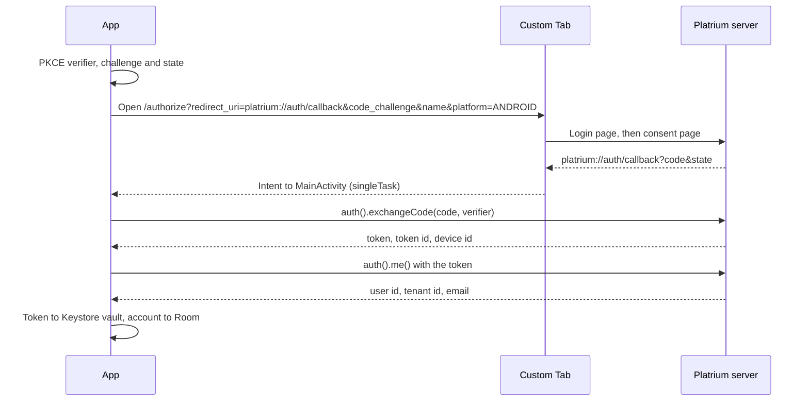

The Android app is a Jetpack Compose app that signs in with the [browser grant](/architecture/authn/native-clients), browses files over GraphQL, and downloads them through the Rust SDK. It follows the same model as the [iOS and macOS app](/architecture/darwin/native-app) (servers, accounts, one token per account), with Android's own pieces where the platforms differ. It lives in `android/`.

It does not have a Document Provider yet, the Android counterpart of the File Provider. Upload, sign-out, removing accounts and FCM push registration are also not built.

## The Dependency Chain

1. **Platrium SDK (Rust):** compiled to `libplatrium_sdk.so` for `arm64-v8a` and `x86_64`, with Kotlin bindings generated by UniFFI (package `uniffi.platrium_sdk`). The `:platrium-sdk` Gradle module points at `sdk/_ffi/android`. See [Android SDK internals](/sdk-internals/supported-platforms/android).
2. **Apollo Kotlin:** executes GraphQL and generates typed models. Its schema is the engine's own `api/graphql/core/*.graphql`, the same files the web and Darwin clients use. Gradle copies them to `build/graphql-schema` with a `.graphqls` extension because Apollo only picks up that extension. `DateTime` maps to `String` and `Int64` to `Long`. The operations live in `app/src/main/graphql/`.
3. **Jetpack Compose and Material 3:** all UI uses Material 3 components with dynamic color. The navigation bar becomes a rail on wide screens.
4. **Room:** the account database.

Dependency versions are pinned to what the project's Android Gradle Plugin and `compileSdk` accept. Newer AndroidX releases need a higher `compileSdk` and a newer AGP, so bump those together.

## Code Layout

```
org.platrium.platrium
├── PlatriumApplication.kt   AppContainer: builds the app's long-lived objects once
├── MainActivity.kt          single activity; hands the sign-in redirect to the authenticator
├── core/
│   ├── account/             Room entities and DAO, AccountRepository, AccountStore, ServerUrl
│   ├── auth/                Pkce, TokenVault, SignInService, CustomTabAuthenticator
│   ├── network/             ClientFactory (Apollo + SDK per account), ServerProbe
│   └── transfer/            DownloadManager, DownloadService
├── data/
│   ├── files/               FilesRepository (drives, folders, shared with me)
│   └── sharing/             SharingRepository (access, roles, general access)
└── ui/
    ├── setup/  accounts/  files/  share/  transfers/  settings/
    ├── navigation/          destinations, the signed-in shell, AppChrome
    └── common/              shared components, formatting, icons
```

Dependencies are wired by hand in `AppContainer`, not with a DI framework. `AccountStore` is the single owner of "who am I signed in as", and the UI reads its flows. ViewModels get what they need from the container and are keyed by account, so switching account never shows another account's data.

## Servers and Accounts

The model is the same as on iOS: a **server** is an address, an **account** is one user signed in on one server, identified by `(server, tenant, user)`, and signing the same user in again keeps the account id.

State lives in a Room database (`platrium.db`):

| Table | Holds |
|---|---|
| `server` | `id`, `name`, normalized `url` (unique). |
| `account` | `id`, `server_id` (cascade delete), the server's tenant and user ids, `email`, the server-side `token_id` and `device_id`, and a `status` of `ACTIVE` or `NEEDS_REAUTH`. Unique per server, tenant and user. |
| `setting` | The active account and server. |

The active selection repairs itself when what was stored no longer exists: the stored account, else the first account of the stored server, else the first account anywhere, else the first server.

### Tokens

Each account's bearer token is encrypted with an **AES-GCM key held in the Android Keystore** (hardware backed where the device has it, and not exportable). Only the ciphertext is stored, in a private preferences file keyed by the account id. A blob the key cannot open is treated as no token, so the account asks the user to sign in again. Tokens and the database are excluded from backup and device transfer, since a restored blob could never be decrypted.

## Signing In



- The browser step is a **Custom Tab**. `MainActivity` is `singleTask` with an intent filter for `platrium://auth/callback`, and `CustomTabAuthenticator` completes the waiting sign-in with the redirect URL. Leaving the tab does not tell the app anything, so the sign-in screen has a Cancel button.
- The request carries `platform=ANDROID`, so the server registers this installation as a **device** that appears under *Devices & Apps* on the web.
- Both server calls go through the Rust SDK (`client.auth()`), so an API change breaks the build here too.
- **Custom Tabs are not ephemeral.** A second user on the same server lands in the existing browser session. A "not you?" switch on the login page is planned and is not built yet.
- A custom scheme can be claimed by another app. PKCE makes a stolen code useless. An `https` app link listed in `AUTH_NATIVE_HTTPS_REDIRECTS` is the stricter option.
- The token is stored first and the account row second, and the token is removed again if the row fails to save.

### Authenticated clients

`ClientFactory` builds one Apollo client and one SDK client (`PlatriumClient.withToken`) per account and keeps them until the credentials change. The Apollo interceptor reads the token from the vault on every request. A `401` marks the account `NEEDS_REAUTH`, and the app shows a **Signed out** screen with a Sign In button.

### Plain http

Servers are `https`. Release builds allow cleartext only to `localhost`, `127.0.0.1`, `10.0.2.2` and `.local` hosts. Android cannot allow a private address range by pattern, so a development server on a LAN address (`http://192.168.x.x:3000`) is blocked there, even though a browser opens it. **Debug builds** override the config (`src/debug/res/xml/network_security_config.xml`) to allow cleartext everywhere, so a phone on the same network can reach a dev engine. The server address field adds `http://` for local and LAN addresses and `https://` for everything else. A blocked request shows up as a generic network error from GraphQL, and logcat names the cleartext policy.

## Browsing and Sharing

- **Files** lists the user's drives, split into private and shared. **Shared with me** pages through `sharedWithMe`.
- A folder pages `folderContents` 50 at a time as the list scrolls, with pull-to-refresh and list or grid view.
- Actions come from each item's `myCapabilities`: Download and Open need `DOWNLOAD`, Share needs `SHARE`, Rename needs `EDIT`, Delete needs `TRASH` or `DELETE`, and New folder needs `CREATE` on the folder. The client never decides on its own what a user may do.
- The **share sheet** mirrors the web dialog. The server decides which roles and general-access levels to offer and what they are called. It shows the people with access, inherited access, the people picker (directory search), the role and expiry for new people, general access with its download and expiry settings, and the inheritance toggle. Roles and levels are plain strings, so values this client does not know are shown by name and never fail.

## Downloads

Downloading uses the SDK's download session, which streams chunks straight into a **file descriptor** the app opens.

- **Download** inserts a pending row into `MediaStore.Downloads` (`Download/Platrium`), writes into it, and clears the pending flag when the file is complete. A failed or cancelled download deletes the row.
- **Open** and **Share** download into the app's cache and hand a `FileProvider` URI to another app. The cache is cleared at the next launch.
- `DownloadManager` owns the work and the list of transfers. Progress comes from the SDK's transfer events. `DownloadService` is a foreground service of type `dataSync` that only keeps the process alive and shows the progress notification. The downloads sheet can cancel a running download. Cancelling cancels the coroutine, which stops the SDK call.

## Tests

`./gradlew :app:testDebugUnitTest` runs on the JVM, with no emulator. It covers the PKCE vector from RFC 7636, server URL normalization, the repository's constraints and selection repair, and the whole sign-in flow with the browser and the SDK calls stubbed (the happy path, a state mismatch, an error redirect, a failed exchange, and signing in again).
