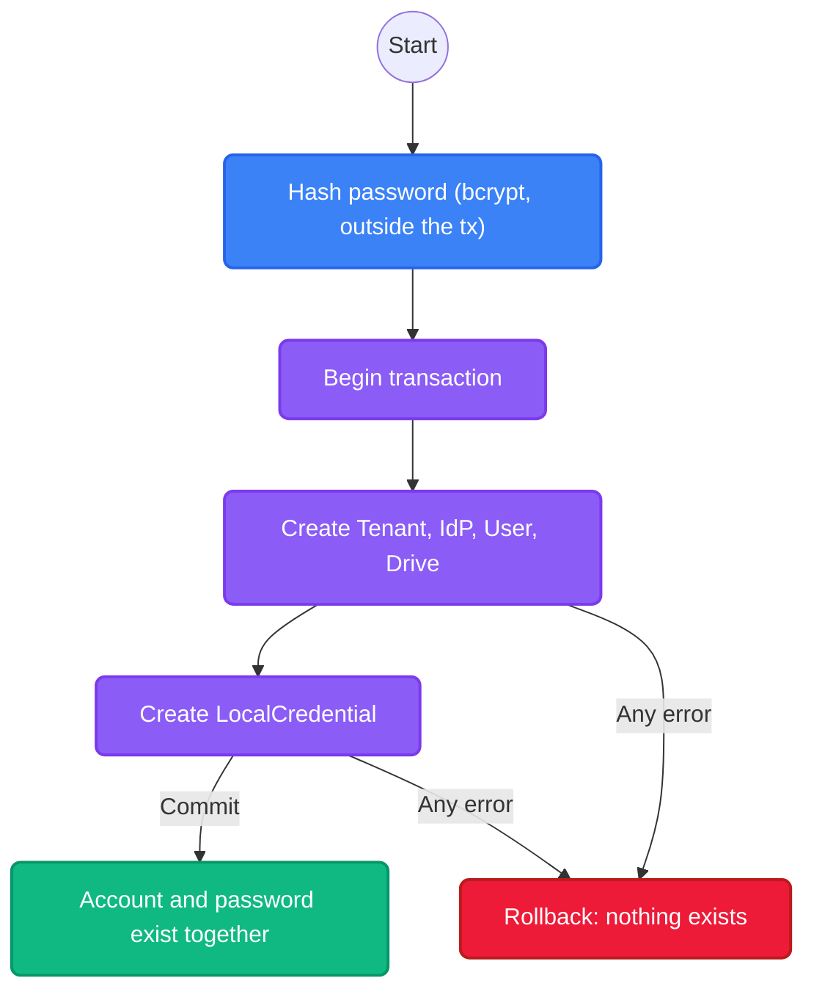

import { Accordion, Accordions } from 'fumadocs-ui/components/accordion';

While Platrium is designed to support Enterprise SSO (SAML, OIDC) out of the box, every system needs a reliable fallback. **Cluster Local Users** represent identities whose authentication secrets (Bcrypt hashes, TOTP seeds) are securely managed directly by Platrium itself, rather than delegated to an external identity provider.

## The LocalCredential Table

A defining architectural decision in Platrium is the separation of **identity** (who a user is) from **authentication secrets** (how they prove it). Secrets live in their own table, `local_credentials`, with a strict one-to-one link to the user:

| Column | Purpose |
|---|---|
| `user_id` | The owning user. Unique, so a user has at most one credential. |
| `tenant_id` | The tenant, used for isolation. |
| `password_hash` | The bcrypt hash. Never the password. |
| `password_changed_at` | When the password last changed. |
| `totp_secret`, `backup_codes` | Second-factor material (optional). |

All secret columns are marked **sensitive** in the schema, so ent never prints them in logs or error messages. Only users bound to a `LOCAL` identity provider can hold a credential; the store verifies this when it is created.

<Accordions>
  <Accordion title="Why a separate table instead of columns on the User?">
    Identity reads are everywhere: listings, sharing autocompletes, session lookups. Keeping secrets on a separate table means those queries never select a password hash, and a bug in one of them cannot leak one. It also means rotating a password or a TOTP seed updates a single small row and leaves the `users` row untouched.
    
    Secrets and identity still share one database, so they can be created, changed and rolled back **together**.
  </Accordion>
  <Accordion title="Why not the KV store?">
    Earlier versions stored hashes in a separate KV store. That forced a "write a temporary record with a TTL, then finalize it" dance, because two different databases cannot share a transaction. Now that credentials live next to users in the same relational database, onboarding is a single atomic transaction and the whole class of orphaned-hash and half-created-user failures disappears.
  </Accordion>
</Accordions>

## Atomic Onboarding

When a user or tenant is created, the password is stored in the same transaction as the account:

1. **Hash First:** `local.HashPassword` runs before the transaction opens. bcrypt takes around 100ms, and we don't want to hold a database connection for that long.
2. **One Transaction:** The tenant, user, drive and `LocalCredential` are all created inside one `db.WithTx` call. `LocalUserStore.CreateTx` takes the transaction, like every other store.
3. **All or Nothing:** If anything fails, the credential rolls back with everything else. There are no temporary records to expire and no finalize step.

## Password Resets

An administrator with `users.update` resets a local user's password through `UserAdmin.ResetLocalUserPassword`. In one transaction it:

1. updates the credential row (keeping the second-factor settings and bumping `password_changed_at`), and
2. sets the user's `sessions_valid_after`, which **signs them out everywhere**: every cookie session and token issued before the reset stops working, and they sign in again with the new password.

Users from an external provider cannot be reset here, because Platrium never held their password. See [signing a user out everywhere](./requests-and-sessions#signing-a-user-out-everywhere).

## One Set Of Rules

Whoever creates a local user, an administrator or the setup flow that makes a tenant's first administrator, goes through the same validation (`local.NormalizeEmail`, `local.ValidatePassword`): a plain email address, stored lowercased, and a password of 8 to 72 characters. bcrypt ignores or rejects anything past 72 bytes, so a longer one would only look stronger.

## Signing In

A local user signs in through the same front door as everyone else. The login page asks the tenant which providers it offers; the built-in one is the email and password form.

1. The user is looked up by their binding (`idp_id` plus `external_id`, which for local users is their lowercased email).
2. Their `LocalCredential` is loaded by `user_id` and the bcrypt hash is checked. An unknown email takes as long as a wrong password, so a stopwatch can't tell which emails have accounts.
3. The result goes through `IdpProvider.Admit`, **the same gate every provider's sign-in passes**: is the provider enabled, is the user disabled, is the email allowed. See [OpenID Connect](./oidc#the-big-idea-protocols-only-verify) for how the other protocols share it.
4. A session is started.

:::info
The built-in provider is read-only and permanent: it cannot be created again, edited, disabled or deleted. It is what keeps the lights on when SSO is down.
:::
