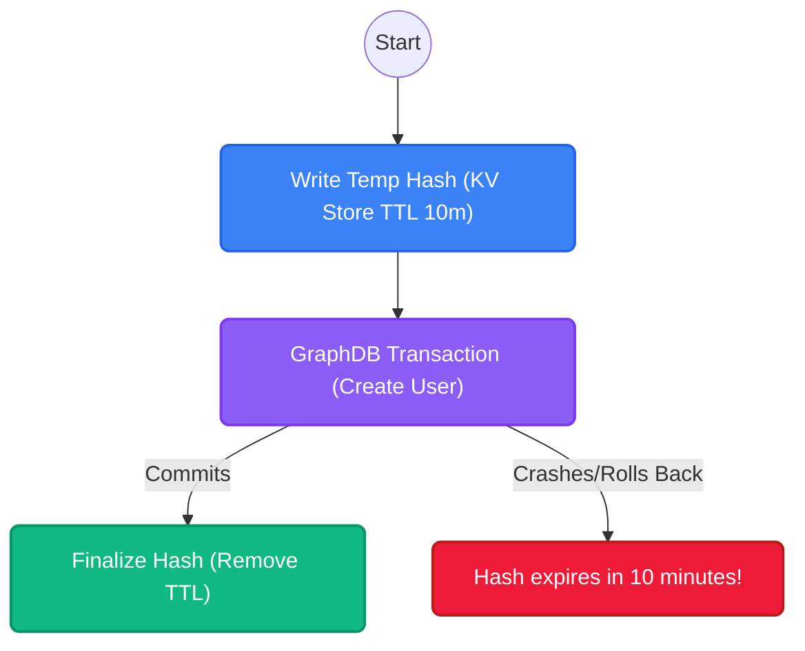

import { Accordion, Accordions } from 'fumadocs-ui/components/accordion';

:::warning
**Work in Progress**
The architectural integration for the `IdPAuthHandoff` engine is actively being developed. The flows and interfaces described here regarding SSO handoffs may change as the feature stabilizes.
:::

While Platrium is designed to support Enterprise SSO (SAML, OIDC) out of the box, every system needs a reliable fallback. **Cluster Local Users** represent identities whose authentication secrets (Bcrypt hashes, TOTP seeds) are securely managed directly by Platrium itself, rather than delegated to an external identity provider.

## The KV Store (BadgerDB, DynamoDB, etc.)

A defining architectural decision in Platrium is the absolute separation of **Authorization (AuthZ)** from **Authentication (AuthN)**.

Graph Databases (Neo4j/Memgraph) are incredibly powerful at resolving structural relationships (AuthZ: "Can User A view Folder B?"). However, they are fundamentally the wrong tool for storing high-frequency, write-heavy cryptographic blobs. 

To maintain blistering speeds, we deliberately partition all Local Authentication secrets into a highly-optimized, embedded Key-Value store like BadgerDB, DynamoDB, etc.

When a local user is created, their secrets are stored as a JSON payload in the KV store under the `auth:local:{userId}` namespace:

```go
type LocalIdentityRecord struct {
	PasswordHash      string   `json:"passwordHash"`
	TOTPSecret        string   `json:"totpSecret,omitempty"`
	BackupCodes       []string `json:"backupCodes,omitempty"`
	PasswordChangedAt int64    `json:"passwordChangedAt"`
}
```

<Accordions>
  <Accordion title="Why separate the hash from the User Node?">
    If we stored the `passwordHash` directly on the `User` node in the GraphDB, every time a user logs in and updates their "Last Login" or rotates their TOTP, we would incur a massive structural graph write.
    
    By moving cryptographic secrets to a dedicated Key-Value store, we keep the GraphDB perfectly pristine and aggressively optimized for Authorization traversals. The KV Store handles the cryptographic heavy lifting without breaking a sweat, ensuring logins are fast and secure.
  </Accordion>
</Accordions>

## Temporary Users

During Tenant and User onboarding, we face a classic distributed systems dilemma: How do we atomically provision a User node in the Graph DB *and* their password hash in the KV Store simultaneously? 

If the server crashes halfway through, we could end up with a devastating state: an orphaned password hash for a user that doesn't exist, or a perfectly formed User node that is impossible to log into!

To solve this mathematically, Platrium uses a **Write-Harmless-First** pattern powered by KV Time-To-Live (TTL):



1. **Create Temporary User:** We first write the `LocalIdentityRecord` to the KV Store using `m.localUserStore.CreateTemporaryUser(..., 10*time.Minute)`. This tells the KV Store to automatically delete the hash in exactly 10 minutes.
2. **Execute Graph Transaction:** We execute the massive GraphDB transaction (creating the Tenant, the User, and the Drive). If this rolls back for *any* reason, we do absolutely nothing. The KV Store record will silently evaporate in 10 minutes, leaving zero orphaned data.
3. **Finalize:** Once the GraphDB safely commits to disk, we call `FinalizeTemporaryUser(...)`. This fetches the temporary record from the KV Store and immediately rewrites it *without* a TTL, permanently locking the user in.

This guarantees flawless atomicity across entirely different database engines!

## IdPAuthHandoff Integration (In-Progress)

When a Local User attempts to log in via the web UI, the request first hits the HRD (Home Realm Discovery) router. Once HRD confirms the target Tenant uses a `LOCAL` IdpConnection, it triggers the `IdPAuthHandoff` flow.

The handoff engine seamlessly ties the two databases together:
1. It retrieves the user's `ID` from the Graph DB based on their email.
2. It queries the `LocalUserStore` (the KV Store) using that `ID` to fetch the `LocalIdentityRecord`.
3. It verifies the Bcrypt hash against the user's input.
4. If successful, it securely issues the final JWT Session!