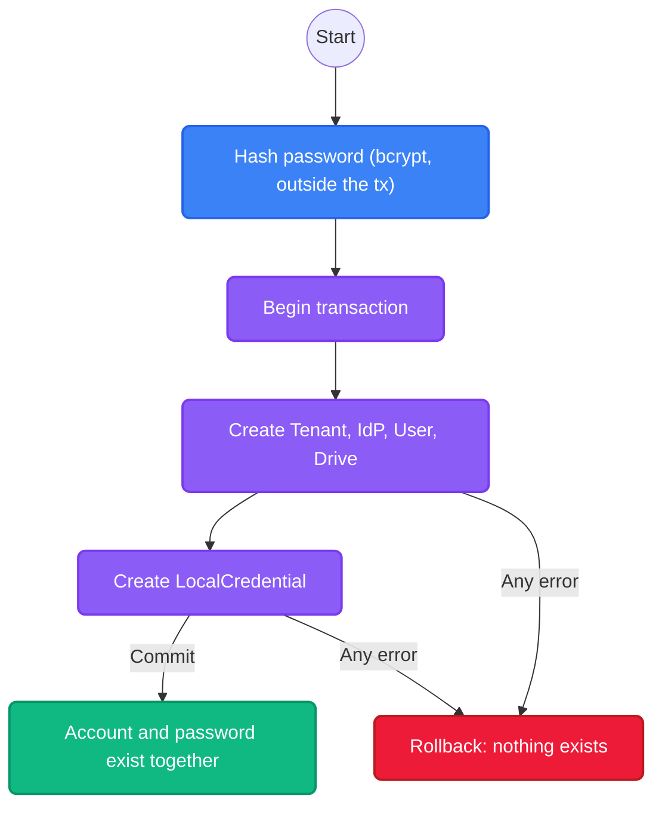

import { Accordion, Accordions } from 'fumadocs-ui/components/accordion';

:::warning
**Work in Progress**
The architectural integration for the `IdPAuthHandoff` engine is actively being developed. The flows and interfaces described here regarding SSO handoffs may change as the feature stabilizes.
:::

While Platrium is designed to support Enterprise SSO (SAML, OIDC) out of the box, every system needs a reliable fallback. **Cluster Local Users** represent identities whose authentication secrets (Bcrypt hashes, TOTP seeds) are securely managed directly by Platrium itself, rather than delegated to an external identity provider.

## The LocalCredential Table

A defining architectural decision in Platrium is the separation of **identity** (who a user is) from **authentication secrets** (how they prove it). Secrets live in their own table, `local_credentials`, with a strict one-to-one link to the user:

| Column | Purpose |
|---|---|
| `user_id` | The owning user. Unique, so a user has at most one credential. |
| `tenant_id` | The tenant, used for isolation. |
| `password_hash` | The bcrypt hash. Never the password. |
| `password_changed_at` | When the password last changed. |
| `totp_secret`, `backup_codes` | Second-factor material (optional). |

All secret columns are marked **sensitive** in the schema, so ent never prints them in logs or error messages. Only users bound to a `LOCAL` identity provider can hold a credential; the store verifies this when it is created.

<Accordions>
  <Accordion title="Why a separate table instead of columns on the User?">
    Identity reads are everywhere: listings, sharing autocompletes, session lookups. Keeping secrets on a separate table means those queries never select a password hash, and a bug in one of them cannot leak one. It also means rotating a password or a TOTP seed updates a single small row and leaves the `users` row untouched.
    
    Secrets and identity still share one database, so they can be created, changed and rolled back **together**.
  </Accordion>
  <Accordion title="Why not the KV store?">
    Earlier versions stored hashes in a separate KV store. That forced a "write a temporary record with a TTL, then finalize it" dance, because two different databases cannot share a transaction. Now that credentials live next to users in the same relational database, onboarding is a single atomic transaction and the whole class of orphaned-hash and half-created-user failures disappears.
  </Accordion>
</Accordions>

## Atomic Onboarding

When a user or tenant is created, the password is stored in the same transaction as the account:

1. **Hash First:** `local.HashPassword` runs before the transaction opens. bcrypt takes around 100ms, and we don't want to hold a database connection for that long.
2. **One Transaction:** The tenant, user, drive and `LocalCredential` are all created inside one `db.WithTx` call. `LocalUserStore.CreateTx` takes the transaction, like every other store.
3. **All or Nothing:** If anything fails, the credential rolls back with everything else. There are no temporary records to expire and no finalize step.

## Password Resets

`SetPassword` hashes the new password and updates the existing credential row. It preserves the second-factor settings and bumps `password_changed_at`.

## IdPAuthHandoff Integration (In-Progress)

When a Local User attempts to log in via the web UI, the request first hits the HRD (Home Realm Discovery) router. Once HRD confirms the target Tenant uses a `LOCAL` IdpProvider, it triggers the `IdPAuthHandoff` flow.

The handoff engine ties the identity and the secret together:
1. It looks up the user by their IdP binding (`idp_id` plus `external_id`).
2. It loads that user's `LocalCredential` by `user_id`.
3. It verifies the Bcrypt hash against the user's input. A wrong password returns `false`; a missing credential returns a not-found error.
4. If successful, it securely issues the final JWT Session!
