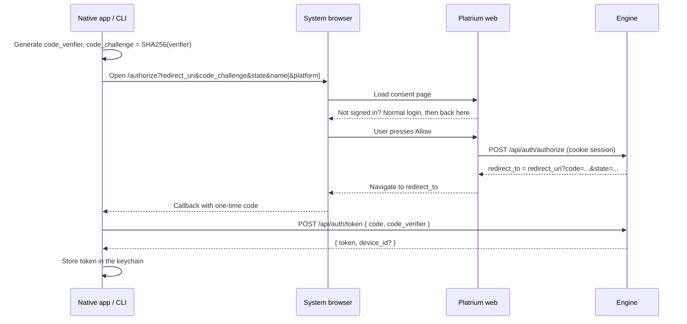

import { Accordion, Accordions } from 'fumadocs-ui/components/accordion';

Browsers sign in with a cookie. Everything else (the iOS and macOS apps, a future Android app, the CLI, a FUSE mount, a CI script) signs in with a **bearer token**. There is one kind of token and one way to get it, whatever identity provider the user belongs to.

## One token, optionally a device

A token is a random secret, `plt_` followed by 256 bits, stored as a SHA-256 hash in `auth_tokens`. The secret is shown exactly once.

The only thing that makes a token a *device* is a link to a `devices` row:

| Client | Has a `devices` row? | Push notifications? | Example |
|---|---|---|---|
| **Device** | Yes (`name`, `platform`, `app_version`, push token) | Yes | Platrium for iPhone |
| **App** | No | No | Platrium CLI, a FUSE mount, a CI script |

The two are bound together: deleting the device deletes its token, and revoking the token deletes its device. There are no `revoked` flags or half-alive states. If the row is gone, the credential is gone.

<Accordions>
  <Accordion title="Why opaque tokens and not JWTs?">
    A JWT cannot be revoked before it expires without a server-side denylist, which is a database lookup anyway. An opaque token costs one indexed lookup per request and can be revoked instantly by deleting its row. It also survives engine restarts, unlike the in-memory cookie sessions.
  </Accordion>
  <Accordion title="Why SHA-256 and not bcrypt?">
    bcrypt exists to slow down guessing of low-entropy secrets like passwords. A token is 256 random bits, so there is nothing to guess and a fast hash is enough. It keeps the per-request lookup cheap, and a database leak still does not reveal usable tokens.
  </Accordion>
  <Accordion title="Do tokens expire?">
    Tokens die after 90 days without use (sliding, tracked in `last_used_at`). Tokens created by hand for scripts can also have an absolute `expires_at`.
  </Accordion>
</Accordions>

## Signing In

Every client uses the same flow: the OAuth authorization-code grant with PKCE, reduced to what Platrium needs. The user signs in on the **web** with whichever identity provider they normally use (local password, and later OIDC or SAML, including MFA). Platrium never needs per-provider code for native clients.



- The **consent page** (`/authorize` in the web app) sits behind the normal login redirect, so a user who is not signed in logs in first and lands back on the approval screen.
- `POST /auth/authorize` needs a **browser session**. A token cannot approve another client, so a leaked token cannot mint more tokens.
- If the request includes `platform` (`IOS`, `MACOS`, `ANDROID`, ...), the client becomes a **device**. Without it, it becomes an **app**.

### Why a code instead of the token in the redirect?

A custom URL scheme like `platrium://` is not private to one app: another app can register the same scheme and receive the redirect. The redirect therefore only carries a **single-use code** that lives for 5 minutes in the KV store (namespace `acod`, keyed by the hash of the code). To turn it into a token the client must also present the `code_verifier`, which never left the app, so an interceptor cannot redeem a stolen code. The code is burned on the first attempt, right or wrong.

### Where the code can be sent

`redirect_uri` is validated before a code is created:

- a custom app scheme (`platrium://callback`; the iOS, macOS and Android apps use `platrium://auth/callback`)
- `http` on a loopback host with any port (`127.0.0.1`, `[::1]`, `localhost`), used by the CLI and FUSE drivers that listen for the callback
- `https` URLs starting with an entry of `AUTH_NATIVE_HTTPS_REDIRECTS` (comma separated), used for universal links on iOS and app links on Android

Everything else, such as `javascript:`, `file:` or `http://example.com`, is refused.

### CLI and FUSE

The CLI opens the browser at `/authorize` with `redirect_uri=http://127.0.0.1:<port>/callback`, listens on that port, and exchanges the code, the same way `gh` and `gcloud` do. Headless machines and CI create a token by hand under **Devices & Apps** and pass it as a bearer token. An RFC 8628 device grant is not implemented; if added later it would mint the same kind of token.

## Using a Token

```http
GET /api/auth/me
Authorization: Bearer plt_...
```

`session.Bearer` (after `session.Middleware`) validates the token and puts the same `PlatriumSession` in the request context that a cookie would, with the tenant read from the token row. Authorization, resolvers and the identity resolver (`actors.Identity`) do not know the difference. A token also stops working if its user is disabled or signed out everywhere, see [from request to identity](./requests-and-sessions). `session.AuthInfoFromContext` says which credential was used (`SESSION`, `DEVICE` or `APP`).

- An invalid or revoked token gets `401` and **never falls back to a cookie**.
- GraphQL subscriptions send `{"Authorization": "Bearer ..."}` in the `connection_init` payload.
- Upload and download passports are a separate, short-lived mechanism and are unchanged.
- `POST /auth/token` is rate limited per IP.

## Endpoints

| Endpoint | Auth | Purpose |
|---|---|---|
| `POST /api/auth/authorize` | browser session | Approve a client, returns the redirect with the code |
| `POST /api/auth/token` | none (rate limited) | Exchange code and verifier for a token |
| `GET /api/auth/clients` | session or token | List devices and apps, flags the current one |
| `POST /api/auth/clients` | browser session | Create an app token by hand |
| `DELETE /api/auth/clients/{id}` | session or token | Revoke a device or app |
| `PUT` / `DELETE /api/auth/device/push` | device token | Register or clear the APNs or FCM token |
| `POST /api/auth/logout` | session or token | Delete the calling token, or destroy the cookie session |
| `GET /api/auth/me` | session or token | Current user, `auth_kind` and `device_id` |

## Push Registration

After signing in, a device registers where to reach it:

```http
PUT /api/auth/device/push
Authorization: Bearer plt_...

{ "transport": "APNS", "token": "<apns device token>" }
```

The token is stored on the device row (`push_transport`, `push_token`, marked sensitive). The device is the one that owns the calling token, so a client can only ever set its own push token. The notification broker will read these when it fans events out to devices.

## Not Yet

- **Browser sessions are not listed.** They are still in-memory SCS sessions. Listing them under Devices & Apps needs a persistent session store.
- **No scopes.** Tokens act as the user. A `scopes` column can be added when something needs narrower tokens.
- **Rate limiting** covers `/auth/token` only. The password login endpoint is not limited yet.
