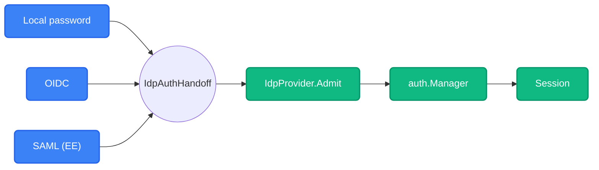
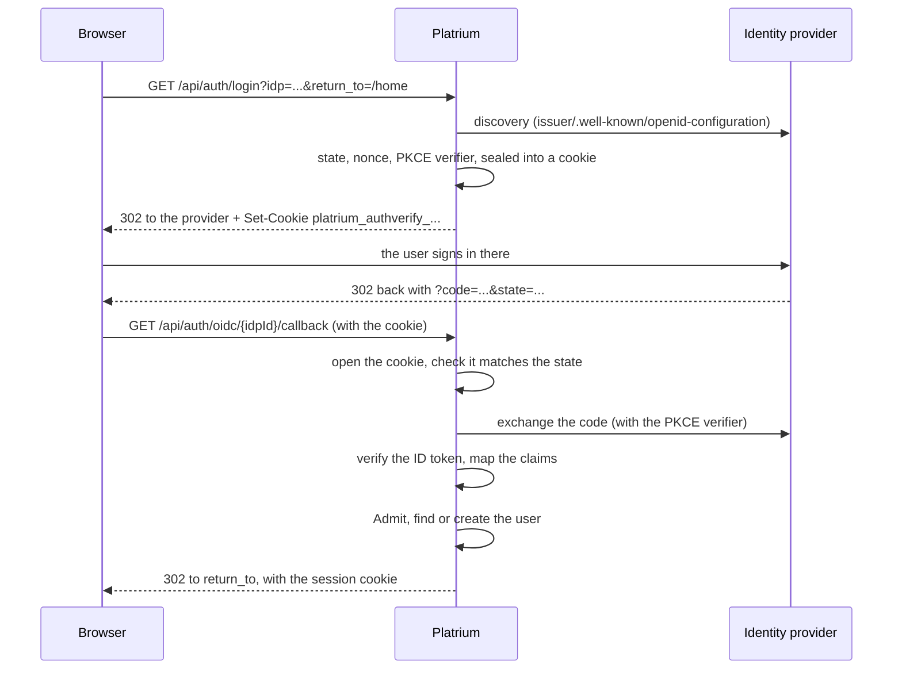

import { Accordion, Accordions } from 'fumadocs-ui/components/accordion';
import { Step, Steps } from 'fumadocs-ui/components/steps';

Platrium can hand sign-in over to any **OpenID Connect** provider. There is no "Auth0 integration" and no "Okta integration": an administrator gives Platrium an issuer URL, a client ID and a client secret, and discovery does the rest. If it speaks OIDC, it works!

:::info
The protocol code is `engine/internal/auth/protocol/oidc`. The generic half (who gets in, and the session) is `auth.Manager` in `engine/internal/auth/manager.go`. Admin APIs are `IdpAdmin` in `engine/internal/orchestrator/idpadmin.go` and `api/graphql/core/idp.graphql`.
:::

## The Big Idea: Protocols Only Verify

Local passwords, OIDC and (in the enterprise edition) SAML all do the same job in the end: prove *who someone is*. Everything after that is identical, so it lives in one place.



A protocol turns its own response (an ID token, a SAML assertion) into an **`IdpAuthHandoff`**: a subject, an email, a name. It does not decide whether the person is allowed in. That is the job of `Admit` and the `Manager`:

- **`IdpProvider.Admit`** is the one gate every sign-in passes. It refuses a disabled provider, a disabled user, and an email outside the provider's allowed domains.
- **`Manager.HandleFederatedLogin`** finds the user, creates them on first sign-in if the provider allows it, keeps their name and email current, and starts the session.

The OIDC handler never asks "is this provider enabled?" It only knows how to do OIDC.

## How A Sign-In Works



The pieces worth knowing:

- **Discovery** finds every endpoint from the issuer URL, so nothing about a provider is hardcoded.
- **PKCE** (S256) is always on, even though we also use a client secret.
- **The ID token** is checked for signature, issuer, audience, expiry and the nonce. If the email is not in the token, we ask the userinfo endpoint, but only trust it for the same subject.
- **`return_to`** is cut down to a same-origin path (and at most 512 characters), so a sign-in link can't bounce you to someone else's site.

### Where A Sign-In In Progress Lives

Between leaving for the provider and coming back, Platrium has to remember the state, nonce and PKCE verifier. It remembers them **in the browser**, in a short-lived cookie that only the server can read.

The value is sealed (encrypted and authenticated) with a key derived from `PLATRIUM_SECRET_KEY`. Each sign-in gets its own cookie, named `platrium_authverify_` plus a short hash of its state. It is `HttpOnly`, `SameSite=Lax`, good for ten minutes, only sent to the callback path, and removed by the callback whatever happens.

<Accordions>
  <Accordion title="Why a cookie and not the session, or the KV store?">
    We tried both before landing here.

    **In the session (SCS):** the session is loaded whole and saved whole, so two sign-ins starting at once (two tabs, a double click) overwrite each other, and the loser comes back as "sign-in expired". We reproduced exactly that. It also creates a session row for every visitor who merely clicks a login button.

    **In the KV store:** it fixes the overwriting, but it costs a write and a read-and-delete on every login, in a store that might be DynamoDB or TiKV.

    **In a sealed cookie:** no storage at all, no shared blob to overwrite, nothing to clean up, and any instance can finish a sign-in another one started, because they all share the key. The session stays purely "who is signed in".
  </Accordion>
  <Accordion title="Can someone replay a callback URL?">
    Not usefully. The cookie is deleted by the first callback, and the provider's authorization code is single-use, so the second exchange fails at the provider. Since nothing is stored on our side, there is no server record to "burn". We lean on the provider's single-use code for that, as most OIDC libraries do.
  </Accordion>
  <Accordion title="What stops someone signing a victim in as the attacker (login CSRF)?">
    The attacker starts a sign-in in *their* browser and gets a callback URL for *their* account. If they trick a victim into opening it, the victim's browser has no cookie for that state, so the callback is refused. A cookie from a different sign-in doesn't open it either, because the sealed value is bound to its own state.
  </Accordion>
</Accordions>

## Who Gets An Account

Identity is the pair **(provider, subject)**: the provider's own stable ID for the person (OIDC's `sub`), never their email.

:::warning
Platrium **never links an external sign-in to an existing user by email.** If it did, anyone who could get a provider to claim `admin@acme.com` would become the admin. A person arriving through Okta with the admin's email address gets their *own* separate account, as a plain member.
:::

Each external provider carries a **provisioning policy**, the same for every protocol:

| Setting | Meaning |
|---|---|
| `jitUsers` | Create the account on first sign-in. When off, only people who already have one can sign in. |
| `defaultRole` | The role a created user starts with. Never an administrative role (see below). |
| `allowedEmailDomains` | When not empty, only these email domains may sign in. |

On every sign-in the user's **email and display name are refreshed** from the provider, which is the source of truth for who they are. Their `external_id` never changes.

<Accordions>
  <Accordion title="Why can't an identity provider make administrators?">
    `defaultRole` must be a role with no permissions at all. The store checks this when the provider is saved, and the manager checks it again at sign-in, in case someone edited the row by hand. If an IdP could mint administrators just by sending people through it, whoever controls the IdP controls Platrium.

    Giving administrator access through an IdP will be an explicit, audited mapping (for example, "members of this group are admins"), designed on its own.
  </Accordion>
  <Accordion title="What about groups?">
    Not in yet. Mirroring a provider's groups into Platrium means adding and removing memberships on every login, with edge cases (a provider that drops the claim for users with too many groups would silently wipe memberships). Enterprises that need it have SCIM, which is built for exactly that.
  </Accordion>
</Accordions>

## Redirect URIs

Every provider is registered with **its own** callback address:

```
{APP_URL}/api/auth/oidc/{idpId}/callback
```

`APP_URL` is the public address of the installation (for example `https://files.example.com`). The provider's ID in the path means a callback says *which* provider, and therefore which tenant, answered before anything else is looked at. With several tenants and several providers each, a single shared callback would have nothing to go on.

The admin API returns the finished address as a read-only `redirectUri`, and the settings page shows it with a copy button.

## Storing A Provider

A provider is two rows. `idp_providers` holds what every provider has (name, type, enabled, the provisioning policy). `idp_oidc_configs` holds the OIDC settings, one row per provider, with typed columns:

| Column | Notes |
|---|---|
| `issuer` | Fixed at creation (see below) |
| `client_id`, `client_secret` | The secret is **sealed** (`enc:v1:...`), bound to the provider's ID |
| `scopes` | Requested in addition to `openid` |
| `email_claim`, `name_claim`, `picture_claim` | Default to `email`, `name`, `picture` |
| `require_email_verified` | On by default |
| `extra_auth_params` | For providers that need more, such as Auth0's `audience` |

A later SAML provider gets its own table beside this one, so each protocol has typed, required columns instead of a blob of JSON.

### The Secret Key

`PLATRIUM_SECRET_KEY` is **required**: the engine will not start without it. It must be the same on every instance of a cluster. Different purposes (signing upload receipts, sealing client secrets, sealing sign-in cookies) get their own keys derived from it, so none shares raw key bytes with another.

:::warning
Change the key and every sealed client secret becomes unreadable: the providers stay, and each needs its secret entered again. Pick one and keep it safe.
:::

<Accordions>
  <Accordion title="Why is the issuer fixed after creation?">
    Users are known by (provider, subject), and a subject only means something to the issuer that minted it. Point an existing provider at a different issuer and someone else's `sub` could land on one of your users' accounts. A different issuer means a new provider.
  </Accordion>
  <Accordion title="A trailing slash on the issuer?">
    It doesn't matter. The spec says the issuer a provider reports must match exactly, and Auth0 reports a trailing slash while most others don't. Platrium accepts a difference of only a trailing slash, then checks ID tokens against exactly what the provider reports. Any other difference is still refused.
  </Accordion>
</Accordions>

## The Built-In Provider Is Special

Every tenant gets one `LOCAL` provider when it is created. It is the fallback that keeps people signed in when SSO is down, so it is **read-only and permanent**: it cannot be created again, edited, disabled or deleted. That rule is in `IdpStore` and nowhere else, so every caller gets the same answer.

## Managing Providers

Administrators (anyone holding `idp.manage`, which is the super administrator today) use the **Identity providers** page in the admin console, backed by these GraphQL fields:

| Field | Does |
|---|---|
| `identityProviders`, `identityProvider(id)` | List and read, with user counts. Never returns a secret. |
| `createIdentityProvider` | Creates the provider and its config together. `config` is a `@oneOf` input: exactly one protocol. |
| `updateIdentityProvider` | The settings every type shares |
| `updateOidcConfig` | OIDC connection settings. Leave `clientSecret` out to keep the current one. |
| `setIdentityProviderEnabled` | Disabling refuses new sign-ins; accounts and files stay |
| `deleteIdentityProvider` | Only with no users. Otherwise disable it. |
| `testOidcDiscovery` | Checks an issuer URL before anything is saved |

The settings every provider shares are one form, whatever the type. Only the connection settings differ, and the web app takes them from a small registry (`connections/index.ts`), so adding SAML later is one new entry.

## Trying It With Auth0

Auth0 is a handy way to try this without running your own provider.

<Steps>
<Step>

**Start the engine with the two required settings.** `APP_URL` is where you open Platrium in the browser, and the key can be any long random string:

```bash
export APP_URL=http://localhost:3000
export PLATRIUM_SECRET_KEY="$(openssl rand -base64 32)"
```

</Step>
<Step>

**Create an application in Auth0.** Choose *Regular Web Application*. Note its **Domain**, **Client ID** and **Client Secret**. Leave the callback URL empty for now.

</Step>
<Step>

**Add the provider in Platrium.** Sign in as the super administrator, open *Admin console, Identity providers, Add provider*. Use `https://<your-tenant>.us.auth0.com` as the issuer, press **Test**, then enter the client ID and secret.

</Step>
<Step>

**Copy the redirect URL.** After you add the provider, Platrium shows its callback address. Paste it into the Auth0 application under **Allowed Callback URLs**, and save.

</Step>
<Step>

**Sign out and try it.** The login page now has a "Login with ..." button. A first sign-in creates an account as a member, if you left account creation on.

</Step>
</Steps>

:::note
Browsers share cookies across ports on `localhost`. If you run two engines on different ports, they overwrite each other's login cookie, which looks like random sign-outs. Stick to one engine at a time.
:::

## When Something Goes Wrong

A failed sign-in sends the person back to the login page with `?error=<code>`, and the page shows a plain sentence. The detail goes to the engine log, never to the browser.

| Code | Means |
|---|---|
| `sso_denied` | The person or the provider declined |
| `sso_expired` | The sign-in is stale, already used, or this browser didn't start it |
| `sso_no_account` | No account, and the provider doesn't create them (or the email domain isn't allowed) |
| `sso_disabled` | The account or the provider is disabled |
| `sso_failed` | Anything else |

For `sso_expired`, look for the log line starting with `oidc callback`. It says exactly why: no cookie, a cookie from another sign-in, the wrong provider, or too slow.

## Not Yet

- **Logout.** Signing out of Platrium does not sign you out of the provider, and a provider's logout notice does not end Platrium sessions. (`sessions_valid_after` is already there for the second.)
- **Disabling doesn't sign anyone out.** It stops new sign-ins; existing sessions run until they end.
- **Groups and group-based roles.** See above.
- **SSRF protection.** The server fetches the issuer URL an administrator types in. That is fine while only the cluster operator sets issuers, but **before multi-tenancy ships**, a tenant's own administrator must not be able to point it at internal addresses. It needs a guard that refuses private ranges (by resolved IP), switchable off for self-hosted installs that really do use an internal provider.
