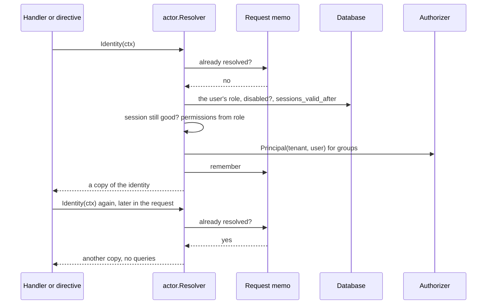
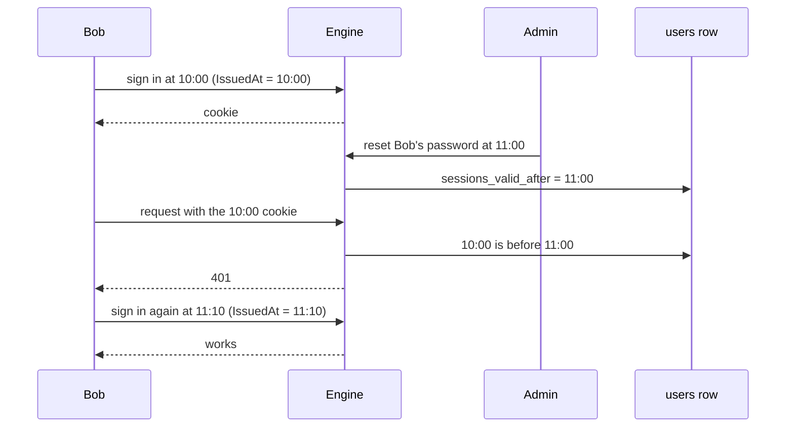

import { Accordion, Accordions } from 'fumadocs-ui/components/accordion';

A request arrives with a cookie or a bearer token. Everything after that, from the `@requires` gate to a file check, needs to know one thing: **who is acting, right now, and are they still allowed to?** This page is how that gets answered, once per request, and how Platrium takes a user's sessions away.

:::info
The code is `engine/internal/auth/actor` (the identity), `engine/internal/auth/session` (cookies and tokens) and `UserStore.RevokeSessionsTx` in `engine/internal/identity/user.go` (signing out). What an identity may *administer* is in [roles and permissions](../authz/permissions).
:::

## The Middleware Chain

`/graphql` and `/api` run the same chain, in this order:

| Step | Does |
|---|---|
| `sessionManager.LoadAndSave` | Loads the browser session (SCS) from the cookie |
| `session.Middleware` | Puts the session's `PlatriumSession` on the request context |
| `session.Bearer` | If there is an `Authorization: Bearer` header, validates the token and puts the **same** `PlatriumSession` on the context. A bad token is `401` and never falls back to a cookie |
| `actors.Middleware` | Gives the request a place to remember its identity (see below) |

A `PlatriumSession` is only a *claim*: a user ID, a tenant ID and when it was issued. It says nothing about whether that user is still allowed in. The actor package decides that.

## One Identity Per Request



The first call does two reads, the user's account row and their groups. The tenant's native flag is remembered after the first lookup. Everything after that in the same request reuses the result.

### What The Identity Holds

| Field | Meaning |
|---|---|
| `Principal` | Tenant, user and **every group** they belong to, for item checks |
| `Role` | The user's tenant role |
| `Perms` | What they may administer, [cluster permissions already withheld](../authz/permissions#the-native-tenant) |
| `Native` | Whether they belong to the installation's native tenant |

### When A Session Is No Longer Good

The resolver answers `ErrUnauthenticated`, which clients see as `UNAUTHENTICATED`, when any of these hold:

1. There is no session.
2. The user is not in the session's tenant (removed, or a forged tenant).
3. The user is **disabled**.
4. The session was issued **before** the user's `sessions_valid_after` (see below).

`PrincipalOrAnonymous` turns that into a visitor instead of an error. That is for operations open to public links: a stale session there is treated as no session at all.

### Why It Is Not A Cache

The identity lives for **one request** and is read fresh each time a new request starts, so a disabled or demoted user loses access on their very next request. It is not stored in the session and not shared between requests.

<Accordions>
  <Accordion title="Why not put the role or permissions in the session?">
    The session is created at sign-in and lives for up to 72 hours. A role stored in it would keep a demoted administrator an administrator until it expired, and a disabled user signed in. Reading one row per request is cheap, and it makes every change take effect immediately. (See [what we don't cache](../authz/scaling-and-openfga#what-we-dont-cache-yet).)
  </Accordion>
  <Accordion title="Why does every caller get a copy?">
    The remembered identity is shared by the directive, every resolver and every handler in the request. If one of them could change what it was handed, it would change what the others see. So each call returns its **own copy**, groups included, and `PermissionSet` has no way to be modified at all. A test tampers with a copy and checks the next one is untouched.
  </Accordion>
  <Accordion title="Why are WebSockets left out?">
    A subscription outlives any single request. A memo made when it connected would still be answering days later. The middleware skips `Upgrade: websocket`, so every call there resolves fresh. (An already open connection is not cut when a user is revoked later, see the gaps below.)
  </Accordion>
</Accordions>

### Changes Made Mid-Request

A GraphQL request can carry several mutations. If the first one demotes the caller, the second must not run on the role remembered from the start.

So code that changes a user's role, disabled state or password calls `actor.Invalidate(ctx)` after it commits (`UserAdmin` does). The next `Identity(ctx)` reads again. A test demotes the caller in field one and checks field two is refused.

The orchestrators go further and **do not use the remembered identity at all**. They read permissions themselves, because they are the [authoritative gate](../authz/permissions#where-it-is-enforced).

### Who Uses It

| Caller | Uses |
|---|---|
| `@requires` directive | `Identity`, then `Perms.Has(...)` |
| GraphQL resolvers | `Actors.Principal` (or `PrincipalOrAnonymous` for public links) |
| `me` | `Identity`, for permissions and assignable roles |
| REST: files, `AuthMe`, the client and token endpoints | `Actors`, so a stale cookie cannot list devices or **mint a new token** |
| Upload commit | `ForUser(tenant, user)`: there is no session, only a signed passport, and a user disabled since they opened the upload cannot finish it |
| Subscriptions | `Principal` when the subscription opens |

## Signing A User Out Everywhere

Sessions are opaque IDs in a store (SCS), and tokens are rows. Neither can be searched by user in every deployment, and an in-memory session store cannot be searched by user at all. So Platrium does not try to find and delete a user's sessions. It records **when they stopped being valid**.

`users.sessions_valid_after` is a nullable timestamp. A session records when it was issued (`IssuedAt`, set at sign-in, or the token's creation time). If the issue time is earlier than the user's `sessions_valid_after`, the identity is refused.



| Event | What happens to existing sessions and tokens |
|---|---|
| **Admin resets a password** | Voided. `sessions_valid_after` is set in the same transaction |
| **User disabled** | Blocked while disabled, because the identity checks the flag |
| **User re-enabled** | **They come back.** Disabling is not a revocation, so devices work again |
| **Sign out of one browser or device** | Only that cookie or token is deleted |

The single entry point is `UserStore.RevokeSessionsTx`. Anything that should sign a user out everywhere calls it.

<Accordions>
  <Accordion title="Why a timestamp and not a list of sessions?">
    A list needs every session store to be searchable by user, and it would have to be kept in step with tokens, cookies and any future store. A timestamp is one column that is already on the row every request reads. It works with the in-memory store, with a future Redis store, with several engine instances, and for cookies and tokens alike. The price is that revocation is **all or nothing** per user: you cannot void just one of their sessions this way. Signing out a single device deletes that device's token.
  </Accordion>
  <Accordion title="Why is it on the user and not on local_credentials?">
    Because it is about the user's sessions, not about a password. A reset is only one thing that should trigger it. An identity provider's logout notice or a failed token refresh would call it too, and those users have no `local_credentials` row. It is also free to check: the identity already reads the user row.
  </Accordion>
  <Accordion title="What about sessions that existed before this column?">
    They have no issue time, which reads as the zero time. That only matters after a revocation, where it voids them, which is the safe outcome.
  </Accordion>
</Accordions>

## Signing In With A Password

`POST /auth/login` is deliberately boring, with two details.

- **Unknown email and wrong password take about the same time.** When no user matches, the handler still runs a bcrypt comparison against a throwaway hash (`local.BurnVerify`), so a stopwatch cannot tell which emails have accounts. A test fails if that comparison is removed.
- **Every path that creates a local user shares the same rules.** `local.NormalizeEmail` and `local.ValidatePassword` are used by `UserAdmin` and by the setup flow that makes a tenant's first administrator, so nobody can create an account an admin could not.

Login rate limiting is left to the load balancer or proxy in front of the engine.

## Single Sign-On (Planned)

External identity providers don't tell Platrium when someone changes their password there, and the session Platrium issued lives on independently. When SSO lands, the plan is for the provider interface to have a mandatory core (the normalized handoff) plus optional capabilities, checked with a type assertion:

| Capability | Meaning | Who implements it |
|---|---|---|
| Session revalidation | Periodically refresh against the provider and end the session if it refuses | OIDC (refresh token). SAML has no equivalent |
| Logout receiver | The provider tells us a session ended | OIDC back-channel logout, SAML single logout where supported |
| Maximum session age | A hard ceiling per provider (SAML honors `SessionNotOnOrAfter`) | Every provider, as the fallback |

Directory sync (SCIM) removals set `disabled_at`, which already works. Every one of these triggers ends in the same call, `RevokeSessionsTx`, so enforcing them needs nothing new.

## Known Gaps

- **Open WebSockets are not cut** when a user is revoked or disabled later. The check happens when the subscription opens. Cutting them needs a periodic re-check or a hook on revocation.
- **Browser sessions are in memory** (SCS default). They are lost on restart, can't be shared by two engine instances, and can't be listed. SSO needs a persistent store first, and the cookie's `Secure` flag is off.
- **Clock skew** between engine instances blurs the revocation moment slightly, since issue times and revocations come from the application's clock.
- **The bootstrap administrator** (`example@platrium.org`) is created with a fixed password at first start. It is marked TODO until the first-run flow exists. Change it.
- **Revocation is per user, not per session**, as described above.

## Code Layout

```
engine/internal/
├── auth/actor/                  Resolver, Identity, the request memo, Invalidate, ForUser
├── auth/session/                PlatriumSession, cookie and bearer middleware
├── auth/protocol/local/         passwords: hashing, validation, BurnVerify
├── identity/user.go             Account, RevokeSessionsTx, the native tenant lookup
└── restapi/auth_handlers.go     login, AuthMe
```
