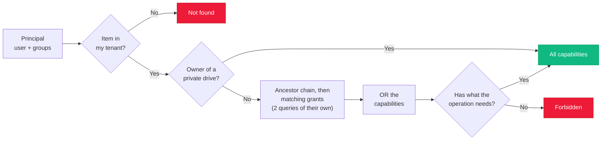
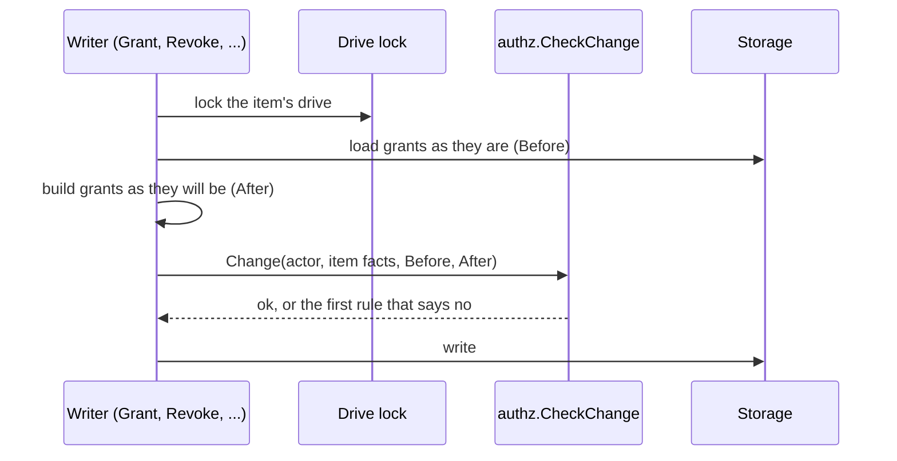

import { Accordion, Accordions } from 'fumadocs-ui/components/accordion';

"Can Alice download this file?" sounds simple, until you add groups, orgs, public links, nested folders, shared drives and a few thousand tenants. Platrium answers it with a small, boring model that lives in plain SQL. Let's walk through it!

:::info
Everything here lives in `engine/internal/authz` (the model and the `Authorizer` interface) and `engine/internal/authz/sqlauthz` (the SQL engine). Enforcement happens in `fsops`, so no resolver or handler can forget to check.

This page is about **items**: files, folders and drives. What a user may *administer* (create users, disable accounts, choose who makes shared drives) is a different model, see [roles and permissions](./permissions). The [overview](./overview) shows how the two fit together, and [from request to identity](../authn/requests-and-sessions) how a request becomes a signed-in principal.
:::

## Capabilities Are Bits

A **capability** is one thing you may do to an item. Each one is a single bit in a 64-bit integer, so a set of capabilities is just a number and "is this allowed?" is one bitwise AND.

| Capability | Bit | Value | Lets you |
|---|---|---|---|
| `LIST` | 0 | 1 | See that an item exists, list a folder |
| `VIEW` | 1 | 2 | Read metadata and preview |
| `DOWNLOAD` | 2 | 4 | Download or copy out the content |
| `COMMENT` | 3 | 8 | Comment (once comments exist) |
| `CREATE` | 8 | 256 | Upload or create inside a folder |
| `EDIT` | 9 | 512 | Rename, replace content |
| `DELETE` | 10 | 1024 | Delete permanently |
| `MOVE` | 11 | 2048 | Move within the drive |
| `TRASH` | 12 | 4096 | Send to trash |
| `MOVE_OUT` | 13 | 8192 | Move or copy out of the drive |
| `SHARE` | 16 | 65536 | Give others access (up to your own) |
| `MANAGE` | 17 | 131072 | Break inheritance, manage settings |
| `DELETE_DRIVE` | 18 | 262144 | Delete a whole drive |

Some capabilities imply others (`EDIT` implies `VIEW`, which implies `LIST`). Grants are normalized when written, so checks never apply rules.

<Accordions>
  <Accordion title="Why a bitmask and not verbs in a table?">
    One row per grant instead of one row per verb. Combining everything a user matches (their own grant, a group's, the org's) is a single `OR` in Go. It's compact, fast to scan, and the hot path stays a plain integer test.

    The price is that bit positions are **forever**. They're pinned by a test (`TestCapabilityBitsAreStable`), because renumbering one would silently corrupt every stored grant. New capabilities take a reserved bit: 24-47 for first-party additions, 48-62 for tenant-defined verbs. Code **preserves bits it doesn't recognize**, so a rolling upgrade never mangles grants a newer node wrote.
  </Accordion>
  <Accordion title="Why store a snapshot of the capabilities instead of just the role?">
    If a grant only said "EDITOR" and we looked the role up at check time, adding a capability to EDITOR next release would silently widen *every existing grant*. Snapshots make new powers opt-in. The role name on a grant is just a label for the UI; the capability number is what counts.
  </Accordion>
</Accordions>

## Grants

A **grant** says: *this subject* gets *these capabilities* on *this item* (and everything under it).

| Field | Meaning |
|---|---|
| `resource_id` | The file, folder or drive root |
| `subject_type` / `subject_id` | `USER`, `GROUP`, `TENANT` (the whole org) or `PUBLIC` (anyone) |
| `caps` | The capability snapshot |
| `role` | A display label |
| `expires_at` | Optional expiry |
| `tenant_id`, `drive_id` | For isolation, and so a drive's grants delete in one statement |

One grant per subject per item, so sharing again just replaces it.

## The Check



Two queries do the heavy lifting (after loading the items and their drives, which also say who owns them): one recursive CTE walks the ancestors up to the drive root, marking every ancestor above a restriction as **cut**, and one indexed lookup loads the unexpired grants that match your user, groups, tenant or `PUBLIC`. On a cut ancestor only grants that carry `MANAGE` count; everywhere else every grant does. `CapsMany` runs the whole thing for **many items at once**, which is how folder listings stay fast.

:::note
A private drive is its owner's alone. Its **contents** can be shared, but the drive's root never carries `SHARE` or `MANAGE`, for anyone, owner included. It is applied in one place, right after the capabilities are worked out, so granting, revoking, general access and inheritance are all covered at once.
:::

:::note
An item you can't see at all is reported as **not found**, never "forbidden". That way nobody can probe which IDs exist. "Forbidden" only appears when you can see the item but lack the capability.
:::

## Inheritance

Grants flow **down** the tree. A grant on a folder covers everything inside it. To lock a subfolder down, set `inherit_perms = false` on it: ancestors' grants stop applying there, and only grants on the item itself (and below) count.

There's one exception, and it's what keeps a drive administrable: **a grant that carries `MANAGE` (a Drive Admin's) keeps applying through a restriction**. Restricting hides a folder from members, editors and public links, never from the drive's admins. So restricting needs no extra grant to "keep you in", and resuming inheritance leaves nothing behind.

There are **no deny rules**. Access only ever adds up, which keeps checks order-independent and easy to explain.

## Groups: Flatten The Small Side

Groups can nest. We keep the direct memberships in `group_members` and a flattened `group_closures` table (every group → every user beneath it), rebuilt in the same transaction as each membership change. Resolving "which groups is Alice in?" is then one indexed lookup, however deep the nesting.

<Accordions>
  <Accordion title="Why not flatten the file tree too?">
    A grant on a folder with a million files would write a million rows, and every move would rewrite them. By flattening only *groups* (small, slow-changing) and walking the tree at check time, a folder move stays a **single-row update**, no matter how many files are inside.
  </Accordion>
</Accordions>

## What Enforces It

Every `fsops` operation requires a capability on the item(s) involved:

| Operation | Needs |
|---|---|
| List a folder, count, breadcrumbs, change feed | `LIST` on the folder |
| Item or file metadata | `VIEW` |
| Download | `DOWNLOAD` |
| Upload, new folder | `CREATE` on the parent |
| Rename | `EDIT` |
| Move | `MOVE` on the item and `CREATE` on the destination (same drive only) |
| Copy | `DOWNLOAD` on the source and `CREATE` on the destination |

Listings, counts, change feeds and breadcrumbs also **hide what you can't see**. A breadcrumb starts at the topmost folder you can open, so someone shared a deep folder never learns the names above it.

## Changing Access: The Rules

Reading access has one choke point (`CapsMany`). **Writing** access has one too: the rules in `authz.CheckChange`.

An item's access is just the set of grants on it, and every write is a change to that set: share, revoke, set general access, restrict, create a drive. So a writer does the same thing every time. It works out what the grants **will be**, hands the before and after to `CheckChange`, and writes only if the rules agree.



| Rule | In plain words | Error |
|---|---|---|
| `no-self-edit` | Nobody changes their own access to an item, up or down. You can't make yourself a viewer of your own file or remove the grant you were given. Someone else has to. | `ErrInvalid` |
| `role-offered` | A grant only carries a role its item and its kind offer: no Drive Admin on a file, no Editor for the public, no expiry where a level can't have one. | `ErrInvalid` |
| `public-allowed` | A public grant is refused when the tenant has turned public sharing off. | `ErrForbidden` |
| `no-escalation` | Nobody hands out more capabilities than they hold. | `ErrForbidden` |
| `never-orphan` | A shared drive keeps at least one **permanent** manager (a user or a group). Removing, demoting or end-dating the last one is refused. | `ErrInvalid` |

<Accordions>
  <Accordion title="Why not a state machine?">
    There are no meaningful named states or transitions here. The "state" is a set of grants, and every write just edits it. What matters are **invariants about the result**, so the rules are predicates over before and after. Adding a rule is one entry in `rules`, not a new transition table.
  </Accordion>
  <Accordion title="Why does never-orphan only protect shared drive roots?">
    A private drive has an owner who always holds every capability, so it can't be orphaned. A shared drive has no owner, so if its last manager goes, only a tenant admin could recover it. Items *inside* a drive need nothing of their own, because the drive's managers keep access even through a restriction. The rule only fires if the drive **had** a manager before, so a broken drive can still be repaired by adding one.
  </Accordion>
  <Accordion title="Why is one change exempt from the rules about what the actor asked for?">
    `GrantInitial` makes the creator the first admin of a new drive, with no acting user. It is tagged `OpInitial` and skips the rules that check what the actor requested. It still goes through `never-orphan`.
  </Accordion>
  <Accordion title="What about group membership?">
    A group counts as a manager, but its **membership** isn't checked by these rules yet. Emptying a group that is a drive's only admin leaves the drive with no working admin. `RemoveMember` and user deletion must build a `Change` and call the same rules when they gain a path from the UI.
  </Accordion>
</Accordions>

### Where It Lives

The rules are in package `authz`, with no database access, and they take plain types: a `Change`, the item's `ItemFacts` (is it a drive root, is it in a shared drive, does it inherit) and the grants. The adapter fills in the facts and does the locking and writing. That is what keeps them engine-neutral. An OpenFGA engine runs the **same rules**, and the shared scenarios in `authztest` check that every engine agrees. See [scaling and OpenFGA](./scaling-and-openfga#what-an-engine-must-provide).

## Code Layout

```
engine/internal/authz/
├── capability.go   the bit registry, implied rules, Verbs()/Parse
├── role.go         built-in roles and their wording per context
├── level.go        the general-access levels (restricted, organization, public)
├── model.go        Principal, Grant, Subject, GeneralAccess
├── rules.go        the change rules and CheckChange (no storage imports)
├── permission.go   admin permissions and tenant roles (see Roles and Permissions)
├── authz.go        the Authorizer interface (reads AND writes), in four parts
├── authztest/      scenarios every engine must pass
└── sqlauthz/       the SQL engine: check, grants, groups, shared, general,
                    and mutate.go (lock, load, check) used by every writer
```

The `Authorizer` interface owns **writes as well as reads**. Each engine stores its own data, so there is never a dual-write to keep in sync. That's what makes swapping engines possible. More on that in [scaling and OpenFGA](./scaling-and-openfga).

### One Contract, Four Parts

An engine implements all of `Authorizer`, which is just four small interfaces put together. Callers depend only on the part they use:

| Part | Methods | Used by |
|---|---|---|
| `Resolver` | `Principal`: a user and their groups | The identity resolver |
| `Checker` | `Caps`, `CapsMany`, `Check` | `fsops`, the file layer |
| `Sharing` | grants, revoking, general access, inheritance, "shared with me" | The sharing resolvers |
| `Membership` | `AddMember`, `RemoveMember` | Directory sync, admin |

`Resolver` only expands **groups**: nested membership is the engine's business, since the SQL engine precomputes it and another engine may not need the list. Whether the user exists or may sign in is not the engine's question, the [identity resolver](../authn/requests-and-sessions) answers that before asking.
