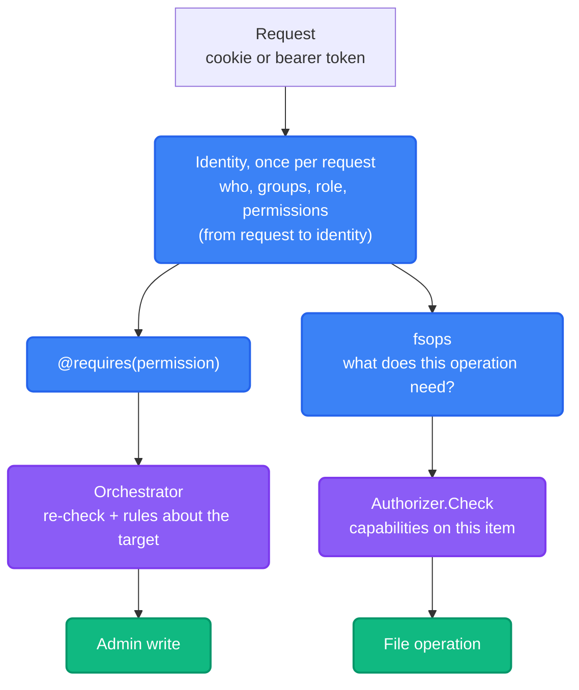

import { Accordion, Accordions } from 'fumadocs-ui/components/accordion';

"Is Alice allowed?" is really two different questions in Platrium. They look alike, but they run on different machinery, so they live on different pages.

| | [Capabilities](./capabilities) | [Permissions](./permissions) |
|---|---|---|
| Answers | What may I do to **this item**? | What may I **administer**? |
| Examples | Download a file, rename a folder, share a drive | Create a user, disable an account, choose who makes shared drives |
| Reaches | The item and everything beneath it | My organization (or the whole installation) |
| Comes from | Grants on the item, its ancestors, my groups | My **tenant role** |
| Stored as | A bit in a 64-bit integer | A name, such as `users.create` |
| Decided by | The `Authorizer` engine (SQL today, maybe OpenFGA) | `authz.EffectivePermissions`, a table in Go |
| Enforced in | `fsops`, on every file operation | `@requires`, then the orchestrators |

<Accordions>
  <Accordion title="Why not one model for both?">
    Capabilities are checked on **every file operation**, per item, against a tree and a pile of grants. That is why they are bits, computed in batches. Permissions are checked a handful of times per admin action against one row, the user's role. Forcing them into one structure would make the hot path carry admin concepts, or the admin path pay for tree walks.

    It also keeps the swappable part small. A future OpenFGA engine replaces how *items* are authorized. Who may create a user is the tenant's business and stays in SQL.
  </Accordion>
</Accordions>

## How They Fit Together

Both start the same way: a request is signed in, and the system works out **who is acting**, once. Then the two paths split.

The top branch is the administrator path, described in [roles and permissions](./permissions). The bottom branch is the file path, described in [capabilities and grants](./capabilities). Sharing sits on the file path: changing who can open an item is a write to its grants, checked by [the change rules](./capabilities#changing-access-the-rules) and shown to people in [sharing and shared drives](./sharing).

## Words That Mean Two Things

A few words are used on both sides. They are not interchangeable.

| Word | Means | Where |
|---|---|---|
| **Principal** | Who is acting, for item checks: tenant, user and every group they belong to | `authz.Principal` |
| **Identity** | A principal plus what they may administer: role, permissions, whether they belong to the native tenant. One per request | `actor.Identity` |
| **Capability** | One thing you may do to an item (`VIEW`, `EDIT`, `SHARE` ...) | [capabilities](./capabilities) |
| **Grant** | A subject gets capabilities on an item and everything beneath it | [capabilities](./capabilities#grants) |
| **Permission** | One thing a user may administer (`users.create` ...) | [permissions](./permissions#permissions) |
| **Native tenant** | The installation's own tenant, the only place cluster permissions apply | [permissions](./permissions#the-native-tenant) |

:::warning
**"Role" has two meanings.**
An **item role** (`VIEWER`, `FULL_EDITOR`, `DRIVE_ADMIN`) is a label for a bundle of capabilities on a *grant*. A **tenant role** (`MEMBER`, `ADMIN`, `SUPER_ADMIN`) is a string on a *user* that decides their permissions. They are separate: being a `SUPER_ADMIN` of your organization does not by itself open anyone's files (access to files comes from grants), and being a `DRIVE_ADMIN` of a drive lets you administer nobody's account.
:::

## Where To Read Next

| If you want to know... | Read |
|---|---|
| How a file check works, what the bits mean, how inheritance and groups behave | [Capabilities and grants](./capabilities) |
| What an administrator may do, which fields are gated, why a check happens twice | [Roles and permissions](./permissions) |
| How sharing looks to users: roles, links, shared drives | [Sharing and shared drives](./sharing) |
| How a cookie or token becomes "who is acting", and how sessions are revoked | [From request to identity](../authn/requests-and-sessions) |
| How fast it is, what is not cached, and how OpenFGA could plug in | [Scaling and OpenFGA](./scaling-and-openfga) |

## Where The Code Is

Both models live in the one package, `engine/internal/authz`: the capability model, the change rules and the `Authorizer` interface on one side, and `permission.go` (permissions and tenant roles) on the other. The SQL engine is in `authz/sqlauthz`. The identity a request runs as is built in `engine/internal/auth/actor`, and the admin rules are in `engine/internal/orchestrator`.
