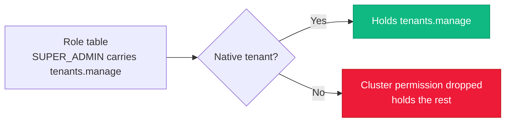
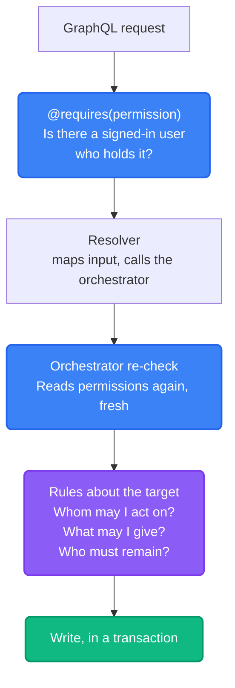
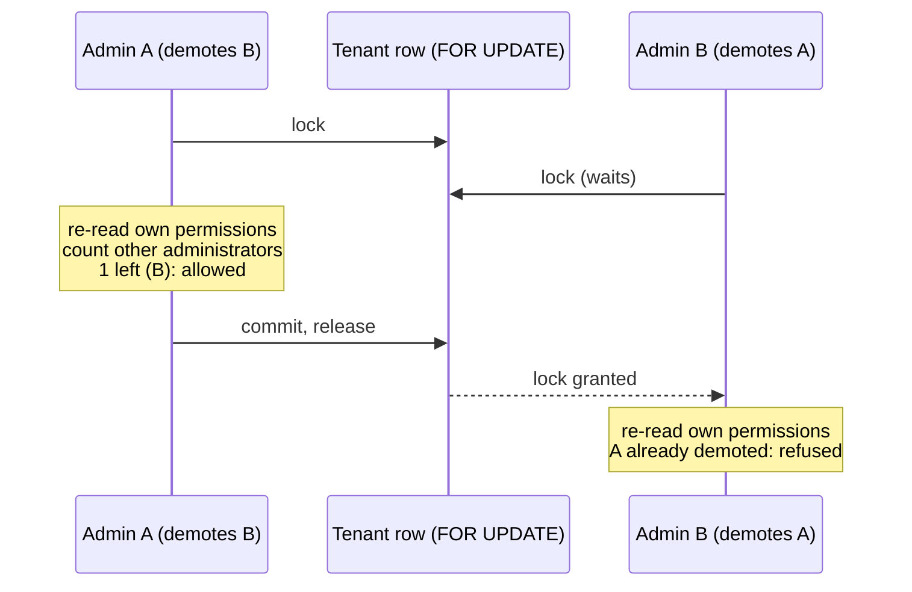

import { Accordion, Accordions } from 'fumadocs-ui/components/accordion';

[Capabilities and grants](./capabilities) answers *"may Alice download this file?"*. This page answers the other question: *"may Alice create users, disable an account or decide who can make shared drives?"*

Those are different questions with different machinery, so Platrium keeps them apart. The [overview](./overview) compares the two side by side.

:::info
Everything here lives in `engine/internal/authz/permission.go` (the model), `engine/internal/orchestrator/useradmin.go` (the rules) and `engine/internal/graphql/admin_helpers.go` (the `@requires` gate). The identity a request runs as is built in `engine/internal/auth/actor`, see [from request to identity](../authn/requests-and-sessions).
:::

## Permissions

A **permission** is one thing a user may do to their organization or to the installation. Code asks *"does this user hold permission X?"*, never *"is this user an admin?"*. What a role means is defined once, in `permission.go`, so it can grow into tenant-defined roles without touching a call site.

| Permission | GraphQL | Scope | Lets you |
|---|---|---|---|
| `users.read` | `USERS_READ` | Organization | List and inspect the organization's users |
| `users.create` | `USERS_CREATE` | Organization | Create users on the built-in (LOCAL) provider |
| `users.update` | `USERS_UPDATE` | Organization | Edit LOCAL users and reset their passwords |
| `users.disable` | `USERS_DISABLE` | Organization | Disable or enable any user, whatever their provider |
| `roles.assign` | `ROLES_ASSIGN` | Organization | Give users a role, up to the permissions you hold |
| `shared_drives.create` | `SHARED_DRIVES_CREATE` | Organization | Create shared drives without a policy grant |
| `policies.manage` | `POLICIES_MANAGE` | Organization | Choose which groups may create shared drives |
| `tenants.manage` | `TENANTS_MANAGE` | **Cluster** | Configure tenants (native tenant only, nothing uses it yet) |

## Roles

A user has one **role**, stored as a plain string on the user row. The role table is the only place a role's meaning is written down.

| Permission | `MEMBER` | `ADMIN` | `SUPER_ADMIN` |
|---|:---:|:---:|:---:|
| `users.read`, `create`, `update`, `disable` | | yes | yes |
| `shared_drives.create`, `policies.manage` | | yes | yes |
| `roles.assign` | | | yes |
| `tenants.manage` (cluster) | | | native tenant only |

An unknown role holds **nothing**. The first administrator of every tenant is a `SUPER_ADMIN`.

### The Native Tenant

One tenant is the installation's own, the **native tenant** (marked by a unique `native_slot`). Cluster permissions only ever take effect for its users, whatever role they hold. An organization's `SUPER_ADMIN` is powerful inside their organization and holds nothing at the cluster level.



This is decided **once**, when a user's permissions are computed. A test pins it (`TestOrdinaryTenantsNeverHoldClusterPermissions`): no role in an ordinary tenant ever carries a cluster permission. Whether the native tenant exists, and which one it is, is remembered after the first lookup, so it costs no query afterwards.

### Permission Sets Are Immutable

`authz.PermissionSet` has no way to add or remove a permission after it is built. A set resolved for a request is shared by everything in it, so it must be impossible to change, not merely discouraged. `Sorted()` returns a copy.

## Where It Is Enforced

An admin action passes through **three** gates, and each one answers a different question.



| Gate | Question | Fails with |
|---|---|---|
| `@requires` in the schema | Do you hold the permission this field needs? | `FORBIDDEN`, or `UNAUTHENTICATED` without a session |
| Orchestrator re-check | Do you hold it **now**, as of the database? | `FORBIDDEN` |
| Rules about the target | May you do this to **this user**? | `FORBIDDEN` or `BAD_REQUEST` |

### `@requires`

```graphql
adminUsers(first: Int, search: String): AdminUserConnection! @requires(permission: USERS_READ)
setUserDisabled(id: ID!, disabled: Boolean!): AdminUser!      @requires(permission: USERS_DISABLE)
```

The directive makes the schema say what is protected. It reads the request's identity (already resolved, usually by the time it runs) and checks `Perms.Has(permission)`. It cannot see its target, so it cannot answer "may you act on *this* user". Those rules live in the orchestrator.

| Field | Permission |
|---|---|
| `adminUsers`, `adminIdentitySources` | `USERS_READ` |
| `createLocalUser` | `USERS_CREATE` |
| `updateLocalUser`, `resetLocalUserPassword` | `USERS_UPDATE` |
| `setUserDisabled` | `USERS_DISABLE` |
| `sharedDriveCreators`, `setSharedDriveCreators` | `POLICIES_MANAGE` |

Fields every signed-in user may call, such as `me` and `canCreateSharedDrive`, carry no `@requires`. Item access is not a permission at all, it is checked per item in `fsops`.

<Accordions>
  <Accordion title="Why check twice?">
    The directive is the **declared** gate: you can read the schema and see what is protected. The orchestrator is the **authoritative** one, for two reasons.

    First, orchestrators are reached by more than GraphQL. A SCIM endpoint or a command line tool calls them with no directive and no request to remember anything. They must not trust that someone upstream checked.

    Second, the directive uses the identity resolved at the start of the request. If an earlier field of the same request changed the caller's role, that identity can be stale. The orchestrator reads fresh. (Writers also clear the request's remembered identity, see [from request to identity](../authn/requests-and-sessions#one-identity-per-request).)
  </Accordion>
  <Accordion title="Why doesn't the orchestrator just use the request's identity?">
    Because it would then trust the transport. The cost of the extra read is one indexed lookup by primary key (the native tenant is remembered), and it buys a boundary that holds however the code is called.
  </Accordion>
</Accordions>

## Rules About The Target

`UserAdmin` (`orchestrator/useradmin.go`) composes identity, the built-in provider and the permission model, so it is not a method on any one of them. Whatever way a caller got in, it enforces:

| Rule | In plain words | Error |
|---|---|---|
| Manage only whom you outrank | You act only on users whose permissions you **hold**. An `ADMIN` cannot disable, edit or reset a `SUPER_ADMIN`. | `ErrForbidden` |
| Give no more than you hold | You can give a role only if you hold every permission it carries (`authz.CanAssignRole`). This is the same idea as `no-escalation` in [the sharing rules](./capabilities#changing-access-the-rules). | `ErrForbidden` |
| Roles need `roles.assign` | Changing anyone's role needs `roles.assign` **in addition to** `users.update`. | `ErrForbidden` |
| Keep an administrator | The last active user who can assign roles is never demoted or disabled. | `ErrForbidden` |
| Not yourself | You cannot disable your own account. | `ErrForbidden` |
| Local users only | Editing and password resets apply to LOCAL users. A user from an external provider is managed there, and only disabling works. | `ErrInvalid` |

Each user the API returns carries `manageable: false` when the viewer does not outrank them, so a client can grey out the buttons. That is a courtesy. The server refuses anyway.

### Why There Is A Tenant Lock

"Keep an administrator" is a read-check-write. Two super admins demoting each other at the same moment would each see the other still in place, both checks would pass, and nobody would be left.



Role changes, and disabling a user, run inside this lock. The actor's own permissions are read **after** it is taken, so a concurrent demotion of the actor counts too. A password reset and a display name change do not change anyone's permissions, so they take no lock.

On SQLite there are no row locks, but writers are serialized anyway. A test hammers this with opposing changes ten times over (`TestConcurrentAdminsCannotRemoveEachOther`).

## What The Client Sees

`me` returns the signed-in user with what they may do:

```graphql
query { me { role permissions assignableRoles } }
```

| Field | Use it to |
|---|---|
| `permissions` | Show or hide admin features. Never compare role names. |
| `assignableRoles` | Fill the role picker with only the roles this user may give |

The web client wraps this in `usePermissions().can(...)` and a `RequirePermission` component. Both are courtesies, since every admin field is also gated on the server.

## Adding A Permission

1. Add the constant and an entry in `permissionRegistry` in `permission.go`, with its scope.
2. Put it in the right roles in `builtinTenantRoles`.
3. Add it to the `Permission` enum in `api/graphql/core/me.graphql` and to `enum_values` in **both** `gqlgen.yml` and `gqlgen-ee.yml`.
4. Put `@requires(permission: ...)` on the fields that need it.
5. Make the orchestrator method check it (`needPermission`), plus any rules about the target.
6. Run the generators (`nx run engine:_generate_graphql_bindings`, then the web one).

`TestEveryRolePermissionIsRegistered` fails if a role carries something that is not registered.

## Code Layout

```
engine/internal/
├── authz/permission.go           permissions, roles, EffectivePermissions, CanAssignRole
├── auth/actor/                   builds the identity (role, permissions, groups) per request
├── orchestrator/useradmin.go     the rules about whom you may act on
├── orchestrator/permissions.go   needPermission, shared by every orchestrator
├── orchestrator/drive.go         shared drive creation and the creators policy
└── graphql/admin_helpers.go      the @requires directive
api/graphql/core/
├── me.graphql                    Permission, Me, me
└── admin.graphql                 @requires and the user administration API
```
