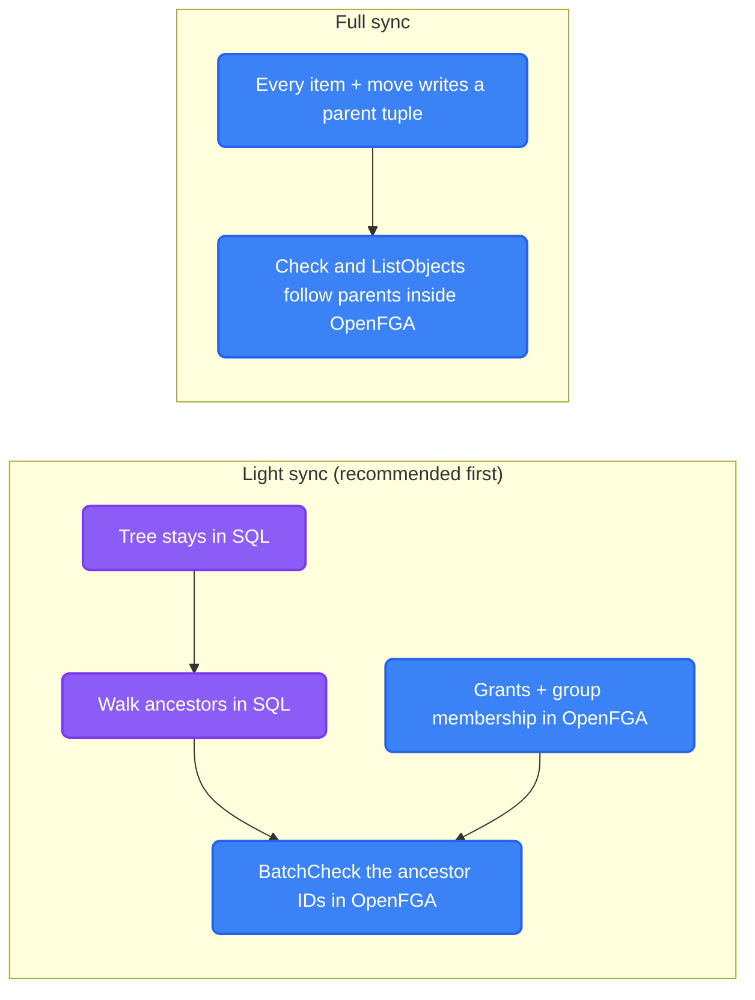

import { Accordion, Accordions } from 'fumadocs-ui/components/accordion';

The default authorizer needs nothing but your database. It's fast enough for a homelab and, with batching, for big tenants. When it isn't, the `Authorizer` interface is the seam where a heavier engine can slot in. It is [four small interfaces](./capabilities#one-contract-four-parts) an engine implements together: resolving a principal's groups, checking capabilities, sharing, and group membership.

## How Fast Is It?

Measured on Postgres 16 with **1M items at depth 20, 100k grants and 500k group-closure rows**:

| Case | Latency | Throughput |
|---|---|---|
| One full check, one client | 0.26 ms | ~3,900/s |
| One full check, 8 clients | 0.65 ms | ~12,000/s |

Through the Go implementation (several round trips, over Docker) one `Caps` call is about 1-1.5 ms, and **64 items in one `CapsMany` call take about 8 ms**. Batching is the real lever: checking a page of results costs one trip, not one per item.

:::info
Listing a folder is one check on the folder plus one batched check on the page, because children inherit. You never pay per file.
:::

## What We Don't Cache (Yet)

There's no permission cache, which makes revocation **instant**: remove a grant and the very next request is refused. We decided that's worth more than shaving a millisecond.

<Accordions>
  <Accordion title="Isn't the per-request identity a cache?">
    Not in the sense that matters. The identity (role, permissions, groups) is resolved once and reused only **inside one request**, then thrown away, so the next request reads fresh and revocation is still instant. Nothing is stored in the session or shared between requests. See [from request to identity](../authn/requests-and-sessions#one-identity-per-request).
  </Accordion>
  <Accordion title="If we add caching later, what would it look like?">
    Start by caching only the *stable* parts: a user's group set (changes on membership edits) and an item's ancestor chain (changes on folder moves). Grants, which churn with every share, stay a live indexed read. Sharing activity then never invalidates anything.

    A decision cache is a last resort, with these rules: only removals of access invalidate it (allows stay correct when access grows), don't cache denials, and put versions in the key (`drive.acl_epoch`, `user.authz_version`) so stale entries simply stop matching. Never put an epoch counter on the drive row itself, because moves already lock that row.
  </Accordion>
  <Accordion title="Why not Redis now?">
    One database round trip costs about what a Redis round trip does, so a cache wouldn't buy much at this scale, and it would trade away instant revocation. Measure first!
  </Accordion>
</Accordions>

## Known Gaps

- **Download passports** are signed tokens valid for 24 hours. Someone who already opened a download keeps fetching chunks after losing access. Shorten the lifetime before relying on instant revocation for downloads.
- **Anonymous reads aren't rate limited.**
- **No trash or soft delete yet**, and no user-deletion purge. Grants and drives carry `drive_id` so a purge is a flat batch, not a tree walk.
- **Searching across shared content** needs a pre-filter to the roots you can reach; there's no "everything I can see" query by design.
- **Moving between drives** is rejected for now.
- **Group membership and user deletion** don't go through the [change rules](./capabilities#changing-access-the-rules) yet. Emptying a group that is a drive's only admin, or deleting its last admin user, can still orphan a drive.

## OpenFGA

[OpenFGA](https://openfga.dev) is a Zanzibar-style engine: you store relationship tuples (`user, relation, object`) and ask questions with `Check`, `BatchCheck`, `ListObjects` and `ListUsers`. It can run **embedded in the Go server** (as Grafana does with Zanzana) or as its own service, over Postgres, MySQL or SQLite.

It isn't built yet. If a customer needs fine-grained features beyond SQL (conditions, `ListUsers` audits, giant group graphs), it would be an **EE engine behind the same `Authorizer` interface**, never a replacement for the SQL one.

### Two Ways To Wire It



| | Light sync | Full sync |
|---|---|---|
| Upload or move | No OpenFGA write | One tuple write per item (a move is delete + write) |
| Consistency | Nothing to race | A new file is denied until its tuple lands, so an outbox plus owner-first checks are needed |
| `ListObjects` | Not available, so "shared with me" stays an indexed SQL lookup on a thin grant index | Available, but slow on big hierarchies |
| Best for | Starting out | The very largest tenants that need enumeration |

Duplication stays proportional to **grants**, not files, in the light mode. And because the `Authorizer` owns writes too, only one engine is authoritative at a time. Switching is a one-time backfill, never a continuous dual-write.

### What An Engine Must Provide

The `Authorizer` interface says what an engine does. Four things decide whether a new engine, OpenFGA included, behaves like the SQL one:

1. **The same change rules.** `authz.CheckChange` is engine-neutral Go. An engine builds a `Change` (the grants before and after, plus `ItemFacts`) and calls it, rather than re-implementing "no self-edit" or "never orphan" in its own terms. Skip this and the engines drift.
2. **Item facts from SQL.** Whether an item is a drive root, sits in a shared drive or inherits comes from the item tree, which stays in SQL in the light-sync mode. The engine reads it from there.
3. **A serialization point.** `never-orphan` is a read-check-write: two admins removing each other at once must not both pass. SQL takes a row lock on the drive. OpenFGA has no transactions or row locks, so an OpenFGA engine still takes that lock **on the SQL drive row** around its read and write.
4. **The shared scenarios.** `authztest.Run` takes a `World` that builds a tenant, users, groups and drives in the engine's own storage, then runs the scenarios against the `Authorizer` interface alone. The SQL engine runs them in `sqlauthz/conformance_test.go`. A new engine passes them before it ships.

<Accordions>
  <Accordion title="What changes if roles become OpenFGA relations?">
    Grants are caps snapshots today, so `no-escalation` compares capability sets. With roles as relations, `Before` and `After` stay role-level and that rule becomes a relation check. The other rules don't change: they look at subjects, roles, expiry and who holds `MANAGE`.
  </Accordion>
</Accordions>

### What The Model Might Look Like

A sketch of the light-sync model: our roles become relations, and the tree isn't in OpenFGA at all.

```text
model
  schema 1.1

type user
type group
  relations
    define member: [user, group#member]
type tenant
  relations
    define member: [user]

type item
  relations
    define viewer: [user, group#member, tenant#member, user:*]
    define editor: [user, group#member, tenant#member]
    define can_view: viewer or editor
    define can_edit: editor
```

<Accordions>
  <Accordion title="Why not make OpenFGA the only store?">
    A few honest reasons. Drive and user **purges** become "read tuples, delete in batches" instead of one `DELETE ... WHERE drive_id`. "Shared with me" and "who has access" become `ListObjects`/`ListUsers`. OpenFGA officially supports Postgres, MySQL and SQLite (beta), so **MariaDB isn't covered** and our homelab tier would carry a second system. We'd also still own `created_by`, audit and policy data in SQL.
  </Accordion>
  <Accordion title="What would we benchmark first?">
    A 2-3 day spike: model our capabilities as relations, run OpenFGA embedded on Postgres, and compare `BatchCheck` over ancestor lists against our CTE at ~1M items, depth 15-20 and 100k grants, plus the cost of purging a user's drive. If SQL is within a small factor, we skip OpenFGA until someone needs its extras.
  </Accordion>
</Accordions>
