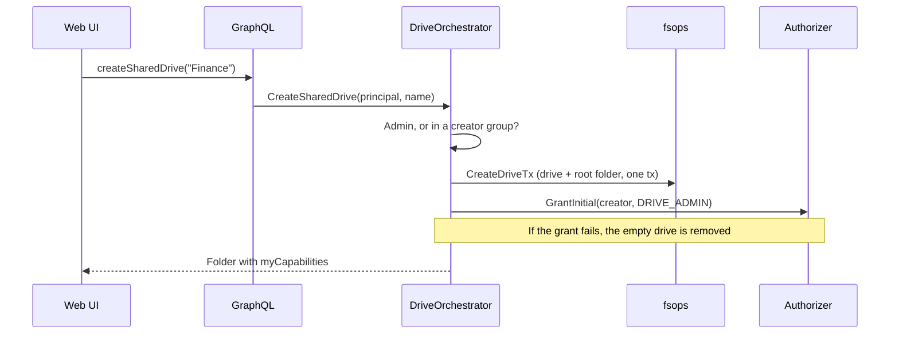

import { Accordion, Accordions } from 'fumadocs-ui/components/accordion';
import { Tab, Tabs } from 'fumadocs-ui/components/tabs';

Sharing is where the capability model meets real people. The rules are small, and the server owns all of them, so every client behaves the same.

## Roles

A role is a named bundle of capabilities. Which roles you're offered depends on **what you're sharing**.

<Tabs items={['Files and folders', 'Shared drive members']}>
  <Tab value="Files and folders">
    A file or folder has an **owner** (the owner of the drive it's in) and can be shared with people, groups, the whole org, or anyone with the link.

    | Role | Shown as | Can |
    |---|---|---|
    | `VIEWER` | Viewer | View and download |
    | `FULL_EDITOR` | Editor | Add, edit, move and trash |

    Editors can't re-share. Only the owner (or a Drive Admin, inside a shared drive) decides who else gets access.
  </Tab>
  <Tab value="Shared drive members">
    A shared drive's root takes the full ladder:

    | Role | Shown as | Adds |
    |---|---|---|
    | `VIEWER` | Viewer | list, view, download |
    | `COMMENTER` | Commenter | comment |
    | `RESTRICTED_EDITOR` | Restricted Editor | create, edit (no move or delete) |
    | `FULL_EDITOR` | Full Editor | move, trash |
    | `DRIVE_ADMIN` | Drive Admin | delete, move out, manage members, delete the drive |

    Anything *inside* a shared drive is an ordinary item again: Viewer or Editor.
  </Tab>
</Tabs>

The server refuses a role the item doesn't offer (no Drive Admin on a single file), and `shareRoles(itemId)` returns the right list **with labels and descriptions**, so the UI never hard-codes wording.

:::note
"No download" isn't a role. It's an option on a grant: the Viewer role with the download bit cleared. Your UI shows it as "Viewer, can't download".
:::

## General Access

Besides the people you add by name, an item has one **general access** setting:

| Level | Stored as | Roles |
|---|---|---|
| Restricted | no extra grant | n/a |
| Anyone in your organization | one `TENANT` grant | Viewer or Editor |
| Anyone with the link | one `PUBLIC` grant | Viewer only |

`setGeneralAccess` swaps it in a single transaction, so an item can never hold two. Both can carry an expiry, and "can't download".

<Accordions>
  <Accordion title="Where's the share link?">
    There isn't a separate one, on purpose! Item IDs are 21 random characters (about 126 bits), so the item's own URL (`/folder/:id`, `/file/:id`) *is* the link, exactly like Google Drive. A public grant makes that URL open without signing in. This keeps the model small: no token table, no token hashing, no new kind of principal.

    If a customer ever needs several links per item, per-link passwords or rotation, a `share_links` table is an additive change on top of the same grants.
  </Accordion>
  <Accordion title="Why is public Viewer-only?">
    Anonymous visitors can read, never write. A public "Editor" would only mean something for signed-in people and would confuse everyone, so we don't offer it.
  </Accordion>
  <Accordion title="Can an admin turn public sharing off?">
    Yes! `tenants.allow_public_sharing` blocks new public grants **and** stops existing ones working immediately, at evaluation time. The grants stay in the database, so flipping the switch back restores access.
  </Accordion>
</Accordions>

## Anonymous Visitors

Without a session, a request is an **anonymous principal**: it matches only `PUBLIC` grants, and the tenant comes from the item itself. Visitors can open an item, list a folder, see breadcrumbs from the shared folder down, and download (unless the grant says no download). Every write needs a session.

## Shared Drives

A **private** drive belongs to a user, who holds every capability in it. A **shared** drive belongs to the **tenant**: nobody owns it implicitly, access comes purely from grants, and it survives its members leaving. Shared-drive names are unique per tenant, ignoring case.

Who may create? **Tenant admins** (`SUPER_ADMIN` or `ADMIN`), plus members of any group the admin lists under the `shared_drive_creators` policy (`setSharedDriveCreators`). Group-scoped policies live in a generic `policy_groups` table, so future policies reuse it.

<Accordions>
  <Accordion title="Why an orchestrator instead of putting this in fsops?">
    It crosses three domains: *identity* (is this caller allowed to?), *fsops* (create the drive) and *authz* (make the creator its first admin). `CreateDriveTx` stays a plain row-inserting primitive that tenant provisioning also uses. It isn't an item permission either, since there's no item yet to hold a capability.
  </Accordion>
  <Accordion title="Why GrantInitial?">
    A brand-new shared drive has nobody who can share it yet, so the first Drive Admin needs a grant with no acting user. `GrantInitial` is for trusted server code only and is idempotent. It goes through the engine-neutral `Authorizer`, so it stays correct if grants ever live outside SQL.
  </Accordion>
</Accordions>

## The API

Everything is GraphQL. The management surface is small and the resolvers are one-liners over the `Authorizer`.

| Query | Does |
|---|---|
| `itemAccess(itemId)` | Owner, general access, named grants, access inherited from above, whether it inherits (needs `SHARE`) |
| `shareRoles(itemId)` | The roles to offer, with labels |
| `searchDirectory(query, ...)` | People and groups for the picker (2+ characters, never lists you) |
| `sharedWithMe` | Items shared directly with you, as entry points |
| `canCreateSharedDrive`, `sharedDriveCreators` | Policy |

| Mutation | Does |
|---|---|
| `shareItem` | Add or change a grant |
| `revokeAccess` | Remove one |
| `setGeneralAccess` | Restricted, org, or link |
| `setInheritance` | Restrict or resume inheriting |
| `createSharedDrive`, `setSharedDriveCreators` | Shared drives |

`itemAccess` is built so a client doesn't have to work anything out:

- **`inherited`** lists the access that reaches the item from folders and the drive above, nearest first. Each entry has `inheritedFrom { id, name }` and is read-only here, since it's changed where it was granted. It follows the same rules as the check, so above a restriction only a drive's admins appear. `id` is null, and the name generic, when you can't open that ancestor.
- **`isYou`** is on each grant and on the owner. The server computes it from who is asking, so every client can show "(you)" and leave out the role menu and remove button on your own row, as the [no-self-edit rule](./overview#changing-access-the-rules) requires anyway.

Neither is stored. Both are computed per request.

Every item also carries `myCapabilities`, so the UI shows only what you can do. Errors carry a stable `extensions.code`: `UNAUTHENTICATED`, `FORBIDDEN`, `NOT_FOUND`, `CONFLICT` or `BAD_REQUEST`.

:::warning
The server enforces every sharing rule, whatever the UI shows. You can never grant more than you hold, and only someone with `SHARE` can share. See the full list in [changing access](./overview#changing-access-the-rules).
:::

## Safety Rails

Two rules exist so that access can't be accidentally lost or quietly rewritten.

- **You can't change your own access.** Not by sharing an item with yourself (so you can't make yourself a viewer of your own file), not by demoting or end-dating your own grant, and not by removing it. Someone else with `SHARE` has to do it. This holds for every file, folder and drive.
- **A shared drive always keeps a permanent admin.** The last Drive Admin grant, whether it belongs to a user or a group, can't be removed, demoted or given an end date. Make someone else an admin first. Without this, a drive whose admins all left could only be recovered by a tenant admin.

Restricting an item never locks out a drive's admins: a Drive Admin keeps full access through a restriction, so restricting adds no grant and resuming leaves none behind.

Access you hold *through a group* is not a grant to you, so a group member can manage that group's grant, as long as the drive keeps another admin.
