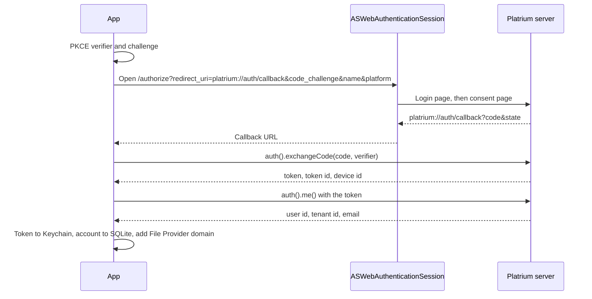

import { Accordion, Accordions } from 'fumadocs-ui/components/accordion';

The Platrium App for macOS and iOS is a thin, native Swift shell. Rather than building a massive monolithic application, the native app acts primarily as a **Host Environment** that binds together several high-performance libraries and registers the system extensions (like the File Provider) with the Apple operating system.

## The Dependency Chain

To keep the native app lightweight, all heavy lifting is delegated to dedicated modules and packages. Here is how the dependencies are linked together within the Xcode project:

1. **Platrium SDK (Rust/WASM):** The core business logic, cryptography, and high-speed network streaming are handled by our Rust SDK. The internals of how we compile this into an Apple `XCFramework` with UniFFI bindings are detailed in the [Apple Darwin SDK Internals](../../sdk-internals/supported-platforms/apple-darwin).
2. **Platrium GraphQL Package:** All API requests and schema definitions are encapsulated in a generated Swift package.
3. **Apollo iOS:** We use the Apollo iOS GraphQL client to execute queries, manage normalized caching, and handle network transport for the API.
4. **SwiftUI Host:** The actual user interface (for login, settings, and status) is built using SwiftUI, which simply observes state from the underlying packages.

## Servers and Accounts

The app can talk to several servers, and several users can be signed in on each. The model has two levels:

- A **server** is a Platrium address (`https://files.example.com`). Adding one asks it who it is through the public `serverInfo` GraphQL query, which also proves the address really is a Platrium server.
- An **account** is one user signed in on one server, identified by `(server, tenant, user)`. Everything that belongs to a person hangs off the account: its token, its GraphQL and SDK clients, and its File Provider domain.

State lives in a small SQLite database (GRDB) in the **App Group container**, so the app and the File Provider extension read the same file. Tokens never go in that file.

| Table | Holds |
|---|---|
| `server` | `id`, `name`, normalized `url`. |
| `account` | `id`, `server_id` (cascade delete), the server's tenant and user ids, `email`, the server-side `token_id` and `device_id`, and a `status` of `active` or `needsReauth`. Unique per server, tenant and user. |
| `setting` | The active account and server. |

The account `id` does three jobs: it is the **Keychain item key**, the **File Provider domain identifier**, and the row's primary key. Signing the same user in again keeps the id, so the token is replaced in place and the domain keeps working.

### Tokens in the Keychain

Each account's bearer token is one Keychain item (service `org.platrium.token`, account = account id). It is available after the first unlock, because the extension can run while the device is locked, and it never syncs to iCloud.

The app and the extension share these items through a **keychain access group** (`$(AppIdentifierPrefix)org.platrium`), listed in both targets' entitlements. This is separate from the App Group, which only shares files such as the SQLite database. Neither the access group nor an explicit group attribute needs to appear in code: the system files an item under the first group in the entitlement.

## Signing In

The app never sees the user's password. It uses the browser grant described in [Native Clients](/architecture/authn/native-clients), which works the same way for local users and any future OIDC or SAML provider.

- The browser session is **ephemeral**, so it never reuses Safari's cookies. That is what lets a second user sign in on the same server instead of silently re-approving the first.
- The request carries `platform` (`IOS` or `MACOS`), so the server registers this installation as a **device**. It then shows up under *Devices & Apps* on the web, where a user can revoke it.
- The two server calls go through the Rust SDK (`client.auth()`), whose types are generated from the engine's OpenAPI. If the API changes, the SDK stops building and the Swift code stops compiling, instead of failing at runtime.
- If the server later rejects the token (a revoked device, say), the account flips to `needsReauth`. The app shows a **Signed Out** screen with a Sign In button, and the extension reports `notAuthenticated` to the system. Signing in again replaces the token and the extension picks it up on its next request, since it reads the Keychain on every call.

## Shared Code

The app target and the File Provider extension share no source files, so everything they both need lives in the local Swift package `PlatriumCore`: the models, the store, the Keychain vault, PKCE, the sign-in service, and the authenticated client factory. Its tests run on the Mac with `swift test`. With `PLATRIUM_TEST_SERVER`, `PLATRIUM_TEST_EMAIL` and `PLATRIUM_TEST_PASSWORD` set, they also run the whole sign-in flow, revocation included, against a live engine.

## Sharing

The share sheet is the web dialog's native twin and uses the same GraphQL API (`itemAccess`, `shareRoles`, `generalAccessOptions`, `searchDirectory`, `shareItem`, `revokeAccess`, `setGeneralAccess`, `setInheritance`). The server decides everything: which roles exist for an item, who may share, and what is valid. The app only asks and shows, so role names, descriptions and access levels come from the server and a new role needs no app update.

- **Where it opens:** a *Share…* item in the context menu, a leading swipe on iOS, and a toolbar button for the folder being viewed (*Manage Access* on a shared drive's root). All three appear only when the item's `myCapabilities` include `SHARE`, which the folder queries now fetch.
- **What it shows:** add people or groups (search starts at two characters), people with access with a role menu and remove, inherited access (read-only, with where it comes from), general access (restricted, organization or anyone with the link, with role, download and end-date options), and whether the item inherits from the folder above. *Copy Link* puts `<server>/folder/<id>` or `/file/<id>` on the pasteboard.
- **Where the logic lives:** `SharingService` in `PlatriumCore` wraps the operations and maps them into plain values, so it is tested against a live engine, including sharing with a second user and the denied cases. `ShareViewModel` in the app holds the sheet's state. Failures show the server's own message, mapped by its error code (`FORBIDDEN`, `NOT_FOUND`, ...).

## Hosting the File Provider

The most critical job of the native app is to host and register the **FileProviderReplicatedExtension**.

Because Apple enforces strict security sandboxes, a File Provider Extension cannot run independently: it *must* be bundled inside a host `.app`.

The host app registers **one domain per account** with `NSFileProviderManager` (essentially a virtual hard drive for that user on that server). The domain identifier is the account id, which is how the extension finds out whose files it is serving. Once registered, the system takes over, launching the `FSExtension` process in the background and asking it to populate the files.
