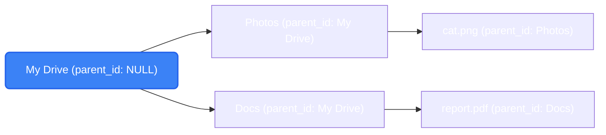

import { Accordion, Accordions } from 'fumadocs-ui/components/accordion';

Every entity has an application-generated string ID and UTC `created_at` / `updated_at` timestamps. `updated_at` is bumped automatically on every update, which is what makes renames and moves show up in change feeds.

## Entity Map

Entities in Platrium are grouped into three primary domains: **Tenants**, **Identities**, and **Storage**. 
Foreign key relationships enforce the hierarchy (e.g., all identities and storage items are bound to a tenant).

### 1. Tenant Domain

| Entity | Description | Relationships |
|---|---|---|
| `tenants` | Root entity representing an organization. | Parent to everything else. |
| `domains` | Custom domains tied to a tenant. | Belongs to `tenants` (`tenant_id`). |

### 2. Identity Domain

| Entity | Description | Relationships |
|---|---|---|
| `idp_providers` | Identity Providers (OIDC, SAML, Local): name, type, enabled flag and the provisioning policy (JIT users, default role, allowed email domains). | Belongs to `tenants` (`tenant_id`). |
| `idp_oidc_configs` | The OpenID Connect settings of an OIDC provider: issuer, client ID, the client secret (sealed with `PLATRIUM_SECRET_KEY`), scopes and the claim names it reads. One row per provider, deleted with it. | Belongs to `idp_providers` (`idp_id`, unique). |
| `users` | Individuals authenticated via an IdP. | Belongs to `tenants` (`tenant_id`) and `idp_providers` (`idp_id`). |
| `groups` | Collections of users. | Belongs to `tenants` (`tenant_id`) and `idp_providers` (`idp_id`). |
| `local_credentials` | Password hashes for local IdP users. | Belongs to `users` (`user_id`). |
| `devices` | Registered native clients (iOS, macOS, Android) and their push token. | Belongs to `users` (`user_id`). Owns one `auth_tokens` row. |
| `auth_tokens` | Bearer credentials for devices and apps (CLI, FUSE, scripts). Only the SHA-256 is stored. | Belongs to `users` (`user_id`); optionally to `devices` (`device_id`, cascades). |

### 3. Storage Domain

| Entity | Description | Relationships |
|---|---|---|
| `drives` | A distinct container of files/folders. | Belongs to `tenants` (`tenant_id`), owned by `users` (`owner_id`). |
| `drive_items` | Unified table for both FOLDERS and FILES. | Belongs to `drives` (`drive_id`), references itself (`parent_id`). |

## The Drive Tree

Files and folders share one table, `drive_items`, with a `kind` of `FOLDER` or `FILE`. Each row stores only its **parent**:

| Column | Meaning |
|---|---|
| `id` | The item ID. |
| `parent_id` | The containing folder. `NULL` only for a drive's root. |
| `drive_id` | The drive this item belongs to. |
| `tenant_id` | The owning tenant. |
| `kind` | `FOLDER` or `FILE`. |
| `size`, `mime_type`, `inline_chunks` | File-only columns. `NULL` for folders (enforced by a `CHECK`). |

A **drive is inherently a folder**. Its root is a `drive_items` row with no parent (`NULL`), and a row in `drives` with the *same ID* carries the extra drive-level metadata (owner, type, quota, usage). Because the IDs match, a drive ID can be used seamlessly anywhere a folder ID is accepted, avoiding any circular foreign keys.

<Accordions>
  <Accordion title="Why store only the parent? Is moving a big folder expensive?">
    No. Moving a folder changes exactly **one row**: the folder's `parent_id`. Its 10,000 children still point at the folder, and the folder now points at its new parent. This layout (an adjacency list) keeps moves O(1).

    The trade-off is that reading a whole subtree, or the chain of ancestors, needs a recursive query. Alternatives that make subtree reads trivial (stored paths, closure tables) make every move rewrite the whole subtree, which is the wrong trade for a file system.
  </Accordion>
  <Accordion title="What is drive_id for?">
    It is a shortcut telling every item which drive it lives in, so we never have to walk up to the root to find out. Moves lock the drive row, drive-wide lookups are one indexed query, and a foreign key guarantees the drive exists.

    The cost is that moving an item **between drives** would require rewriting `drive_id` across the whole subtree. For now, moves are only allowed within a drive.
  </Accordion>
</Accordions>

## Ancestor Queries

Breadcrumbs (`GetItemPath`) and the move cycle check both walk from an item up to its drive root with a single recursive CTE (`fsops/tree.go`). It is the only raw SQL in the filesystem layer. It works identically on Postgres, MySQL 8+, MariaDB and SQLite, scopes every hop to the tenant, and is depth-guarded. The query returns IDs only, and the rows are then loaded through ent.

## Integrity and Tenant Isolation

Platrium ensures data integrity and tenant isolation through a combination of **application-level checks (Stores)** and **database-level constraints**.

### Multi-Tenancy and Isolation

Every tenant-owned row in the database carries a `tenant_id`. Every index serving tenant traffic starts with `tenant_id`, and every query executed by the stores filters on it. 

**Why Application-Level Checks?**
Because `ent` (our database client) cannot easily express composite foreign keys across all our supported engines, the database alone does not prevent a row from referencing another tenant's row. 
Instead, our **Stores** enforce these boundaries before data reaches the database:

- **Users and Groups:** Verifies that the associated Identity Provider (IdP) belongs to the same tenant.
- **Drives:** Verifies that the owner (user or group) belongs to the same tenant.
- **Local Credentials:** Verifies that the user belongs to the tenant and uses a `LOCAL` IdP.
- **Filesystem Operations:** Every call is scoped to the caller's `tenant_id`. If a user attempts to access another tenant's item, it appears as "not found" rather than "permission denied," preventing information leakage.

:::info
These isolation rules are strictly verified by dedicated cross-tenant integration tests.
:::

### Database Constraints

Where possible, we rely on the database schema to enforce rules rather than read-then-write checks in the code, which are prone to race conditions:

| Rule | Enforcement Mechanism | Description |
|---|---|---|
| **Global Names** | `CHECK` constraint | `tenants.alias` and `domains.name` are globally unique and strictly stored in lowercase. |
| **Native Tenant** | Unique Index | At most one **native** tenant can exist. The `native_slot` column is `1` for the native tenant and `NULL` otherwise. A unique index ignores `NULL`s on all supported databases. |
| **User Identity** | Unique Index | Users are strictly unique across `(idp_id, external_id)`. |
| **Drive Structure** | `CHECK` constraint | Only a drive's root folder has no parent (`parent_id IS NULL`), and folders cannot carry file-specific metadata (e.g., size, mime_type). |
| **No Orphans** | `RESTRICT` | Foreign keys use `RESTRICT`. Nothing is silently orphaned or nulled. |

### Error Handling

When the database enforces a constraint, it returns an error. Our stores translate these database-specific constraint violations into portable domain errors (`ErrConflict`, `ErrNotFound`), allowing callers to map them to appropriate HTTP or GraphQL statuses. 

Since database error messages differ by engine (Postgres vs. MySQL), determining *which* specific constraint failed requires reading the state **after** the transaction rolls back, strictly on the failure path.
