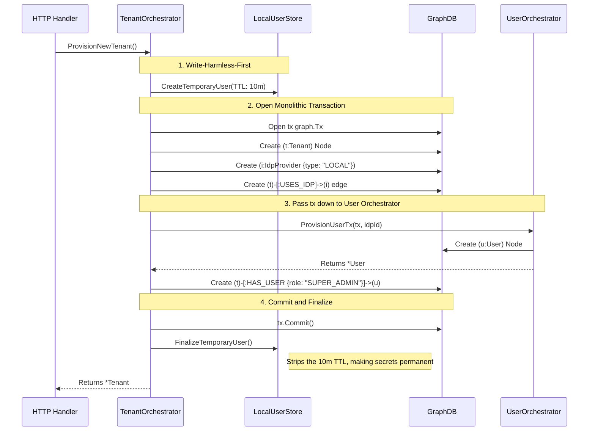

import { Accordion, Accordions } from 'fumadocs-ui/components/accordion';

Platrium is engineered to be **fundamentally multi-tenant from the ground up**. 

Whether you are running a single-tenant open-source instance or a massive Enterprise SaaS cluster, the core data models and orchestrators are exactly identical. Every single `User`, `Group`, `File`, `Folder`, and `IdpProvider` is strictly mathematically bound to a specific `Tenant`. There is no global "God Mode" data.

## The Tenant Node

A `Tenant` represents an isolated workspace, an organization, or a billing unit. In the GraphDB, it is modeled as:

```json
{
  "id": "tnt_acme123",
  "alias": "acme",
  "name": "Acme Corp",
  "isNative": false,
  "createdAt": 1727670000
}
```

- **Alias**: The `alias` (e.g., `acme`) is used for routing and **Home Realm Discovery (HRD)**. Users can navigate to `platrium.org/login` and type in "acme" to be dynamically routed to Acme Corp's specific IdP configurations. 
- **Domains**: In the future, Tenants will also have linked `Domain` nodes (`(t:Tenant)-[:OWNS_DOMAIN]->(d:Domain {name: "acme.com"})`). This allows zero-friction HRD where entering an `admin@acme.com` email instantly routes the user to the correct SSO provider without them ever typing an alias.

## Identity Providers (IdPs) and Multi-SSO

Tenants bring their own authentication rules. A Tenant might strictly enforce Okta for employees, but allow Local passwords for external contractors, or even offer Google Workspace as a third option.

Because of this, a Tenant can have **multiple** `IdpProvider` nodes linked to it.


<Accordions>
  <Accordion title="How does the system know which IdP to use?">
    When a user lands on `platrium.org/login` and types in the alias "acme", the HRD engine queries the GraphDB for all IdPs linked to that Tenant.
    
    If there is only **one** IdP, the system instantly redirects them to it (e.g., Okta).
    
    If there are **multiple** IdPs (like in the diagram above), the HRD engine renders an "IdP Picker" screen. The user is presented with buttons like "Login with Okta", "Login with Google", or "Use Password", allowing them to choose their valid entry path into the Tenant!
  </Accordion>
</Accordions>

## The Tenant Orchestrator

Because Platrium spans across a Graph DB (AuthZ), a KV Store (AuthN Secrets), and a distributed storage engine (Files), creating a new Tenant is a complex, multi-system orchestration.

We guarantee atomic safety using the **`TenantOrchestrator`** (located in `core/internal/orchestrators/tenant.go`). 

The `TenantOrchestrator` wraps the entire setup flow inside a single GraphDB `WriteTx`. If any subsystem fails during onboarding, the entire Tenant creation rolls back instantly, preventing any orphaned data or half-configured workspaces.

### ProvisionNewTenant Sequence

Here is exactly how the Tenant Orchestrator coordinates the massive cross-domain transaction to bring a new workspace online:



By enforcing that the User creation, Drive creation, and Tenant creation all share the exact same `tx graph.Tx` network session, the Orchestrator mathematically guarantees structural integrity across the cluster.