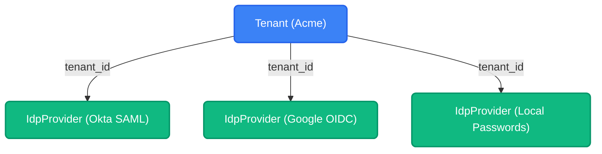
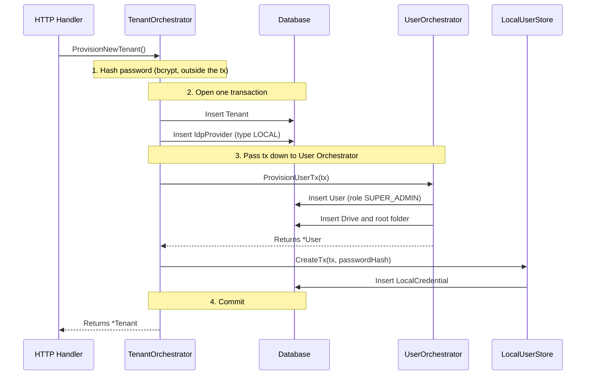

import { Accordion, Accordions } from 'fumadocs-ui/components/accordion';

Platrium is engineered to be **fundamentally multi-tenant from the ground up**. 

Whether you are running a single-tenant open-source instance or a massive Enterprise SaaS cluster, the core data models and orchestrators are exactly identical. Every single `User`, `Group`, `File`, `Folder`, and `IdpProvider` is bound to a specific `Tenant` through a `tenant_id` column. There is no global "God Mode" data.

## The Tenant

A `Tenant` represents an isolated workspace, an organization, or a billing unit. It is a row in the `tenants` table:

```json
{
  "id": "V1StGXR8_Z5jdHi6B-myT",
  "alias": "acme",
  "name": "Acme Corp",
  "isNative": false,
  "createdAt": "2026-10-03T14:20:00Z"
}
```

- **Alias**: The `alias` (e.g., `acme`) is used for routing and **Home Realm Discovery (HRD)**. Users can navigate to `platrium.org/login` and type in "acme" to be dynamically routed to Acme Corp's specific IdP configurations. Aliases are globally unique and always stored lowercase, so lookups are case-insensitive on every database.
- **Native tenant**: Exactly one tenant per cluster can be the *native* tenant. This is enforced by a unique database constraint, not application logic, so it holds even if two instances race at startup.
- **Domains**: Tenants can claim email domains (`domains` table, globally unique, lowercase). This allows zero-friction HRD where entering an `admin@acme.com` email instantly routes the user to the correct SSO provider without them ever typing an alias. A tenant must always keep at least one domain; removal takes a row lock on the tenant so two concurrent removals cannot race past that rule.

## How Isolation Is Enforced

Every tenant-owned row carries a `tenant_id`, every index that serves tenant traffic starts with it, and every store query filters on it. Stores also verify relationships across rows: a user's IdP must belong to the user's tenant, and a drive's owner must belong to the drive's tenant. See [Relational Database](../database/integrity) for the details.

## Identity Providers (IdPs) and Multi-SSO

Tenants bring their own authentication rules. A Tenant might strictly enforce Okta for employees, but allow Local passwords for external contractors, or even offer Google Workspace as a third option.

Because of this, a Tenant can have **multiple** `IdpProvider` rows, each pointing back to the tenant.



<Accordions>
  <Accordion title="How does the system know which IdP to use?">
    When a user lands on `platrium.org/login` and types in the alias "acme", the HRD engine queries the database for all IdPs belonging to that Tenant.
    
    If there is only **one** IdP, the system instantly redirects them to it (e.g., Okta).
    
    If there are **multiple** IdPs (like in the diagram above), the HRD engine renders an "IdP Picker" screen. The user is presented with buttons like "Login with Okta", "Login with Google", or "Use Password", allowing them to choose their valid entry path into the Tenant!
  </Accordion>
</Accordions>

## The Tenant Orchestrator

Creating a new Tenant touches several domains at once: the tenant itself, its identity provider, its first user, that user's drive and their password. All of them live in one relational database, so we guarantee atomic safety with a single transaction.

The **`TenantOrchestrator`** (located in `engine/internal/orchestrator/tenant.go`) wraps the entire setup flow in one `db.WithTx`. If any step fails during onboarding, the entire Tenant creation rolls back, preventing any orphaned data or half-configured workspaces.

### ProvisionNewTenant Sequence

Here is exactly how the Tenant Orchestrator coordinates the cross-domain transaction to bring a new workspace online:



By enforcing that the Tenant, IdP, User, Drive and password all share the exact same `*ent.Tx`, the Orchestrator guarantees structural integrity across the cluster. If the alias is already taken (or a second native tenant is requested), the unique constraint rejects the insert, the transaction rolls back, and the orchestrator reports the specific reason.
