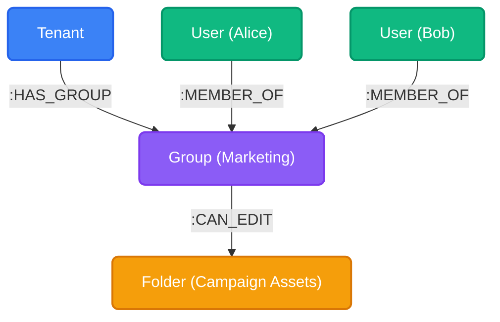
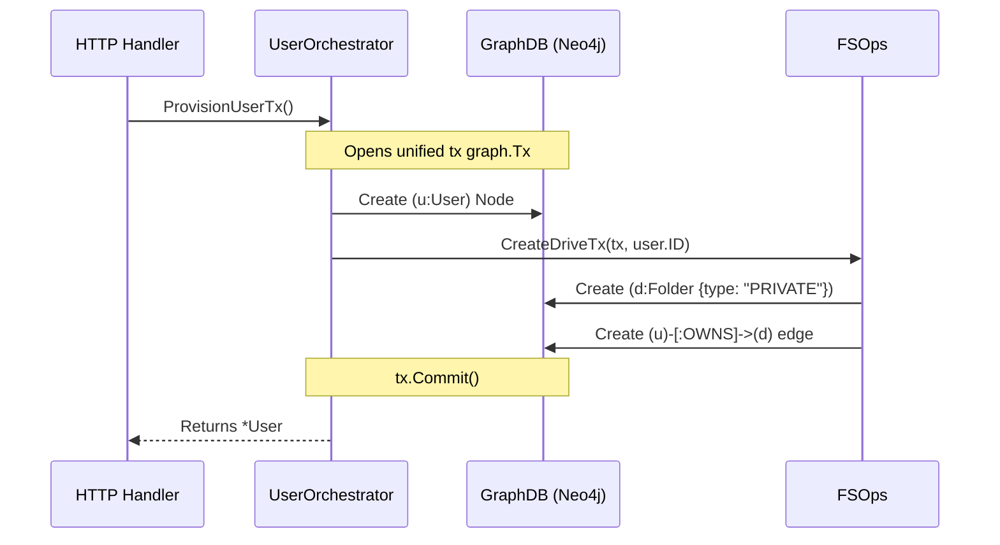

import { Accordion, Accordions } from 'fumadocs-ui/components/accordion';

Users and Groups are the foundational identities within Platrium. Unlike rigid relational databases, Platrium uses a Graph Database (Neo4j/Memgraph) to model these identities, allowing for flexible, heavily-connected authorization structures and rapid edge traversals.

## The User Model

Every user in Platrium is represented by a `User` node, and they inherently belong to a Tenant.

```json
{
  "id": "usr_123xyz",
  "idpId": "idp_google_1",
  "externalId": "104293847291",
  "email": "admin@acme.com",
  "displayName": "Admin",
  "createdAt": 1727670000
}
```

### Minimal Profile Data Design

You might notice that the `User` node is extremely lightweight. We deliberately only store `email` and `displayName`, ignoring extended profile data like phone numbers, physical addresses, or job titles.

<Accordions>
  <Accordion title="Why keep the user profile so minimal?">
    Platrium is fundamentally a distributed storage and collaboration engine, not a Human Resources tool or an SSO Identity Provider (IdP). 
    
    We only store the bare minimum information required to power the core user experience:
    1. **Sharing**: When typing in a "Share File" dialogue, the UI needs an email and name to populate the autocomplete dropdown.
    2. **Sorting & Listing**: When a Tenant Admin views the "Members" table, they need a bird's-eye view of who is in their workspace.
    
    If a workspace uses Okta or Google Workspace, those systems remain the source of truth for rich profile data. Storing it in Platrium just creates syncing headaches.
  </Accordion>
</Accordions>

## The Group Model

Groups are structural collections that users can be assigned to for bulk authorization (e.g., granting folder access to an entire team).

```json
{
  "id": "grp_marketing",
  "tenantId": "tnt_acme",
  "name": "Marketing Team",
  "createdAt": 1727670000
}
```

In the Graph Database, Groups act as authorization hubs. A Tenant owns the Group, Users are members of the Group, and the Group is granted access to Files/Folders.



## IdP Linking (Single Source of Truth)

Notice that the `User` node explicitly contains an `idpId` property. This property maps the user back to the specific Identity Provider (like Google Workspace, Okta, or Local Auth) that controls their authentication.

<Accordions>
  <Accordion title="Why use a property instead of a Graph Edge for IdPs?">
    During early architectural planning, we considered drawing a direct `[:AUTHENTICATES_VIA]` edge between the User and the IdP. 
    
    We had three options:
    1. **Only use an Edge**: This provides blazing fast `O(K)` lookups for migrations, but it means every single daily login and API request would require a graph join just to figure out which IdP the user belongs to, slowing down the most frequent operations.
    2. **Use Both (Edge + Property)**: This optimizes both migrations and daily logins, but creates a massive **split-brain risk**. If a company migrates IdPs, a developer might update the JSON property but forget to redraw the graph edge in a batch script, irreparably breaking the user's state.
    3. **Only use a Property (Our Choice)**: By enforcing the `idpId` JSON property as the *only* link and placing a B-Tree index on it (`CREATE INDEX ON :User(idpId)`), we completely eliminate the split-brain risk and heavily optimize daily logins (`O(log N)` lookup).

    While Graph edges are computationally superior for finding all users during a rare Tenant IdP migration or IdP deletion, those operations are incredibly infrequent. We chose to take the index lookup hit in a background batch job for those rare events, aggressively prioritizing the performance and integrity of the infinitely more frequent daily logins.
  </Accordion>
</Accordions>

## The User Orchestrator

Because Platrium spans a Graph Database, a KV Store (AuthN Secrets), and a distributed storage engine (Files), users cannot just be written to the database with a raw SQL/Cypher insert. 

All user provisioning and deprovisioning is heavily guarded by the **`UserOrchestrator`** (located in `core/internal/orchestrators/user.go`).

### Provisioning Flow

When a new user is created (either via Admin invite or JIT SCIM provisioning), the `UserOrchestrator` coordinates across multiple domains within a single, monolithic database transaction.



By explicitly passing the `tx graph.Tx` pointer down into the Storage engine (`FSOps`), we guarantee that the User's identity and their underlying storage architecture are created atomically. If the drive fails to provision, the user account creation completely rolls back.

### Deprovisioning & Background Deletes

If a Tenant Admin deletes an IdP connection (e.g., removing a legacy Okta integration), we **do not** use a database-level cascading `DETACH DELETE` to wipe out the users. 

Because a User is a distributed entity, a blind database delete would leave gigabytes of orphaned zombie data in the object storage and KV stores.

Instead, when an IdP is deleted:
1. The system queries the B-Tree index for all associated users (`MATCH (u:User {idpId: $idpId})`).
2. It pushes those user IDs into a background worker queue.
3. The background worker calls the `UserOrchestrator.DeprovisionUser()` workflow.
4. The Orchestrator systematically tears down their KV secrets, triggers the Storage Engine to aggressively garbage-collect their drives, and *finally* deletes the Graph node.