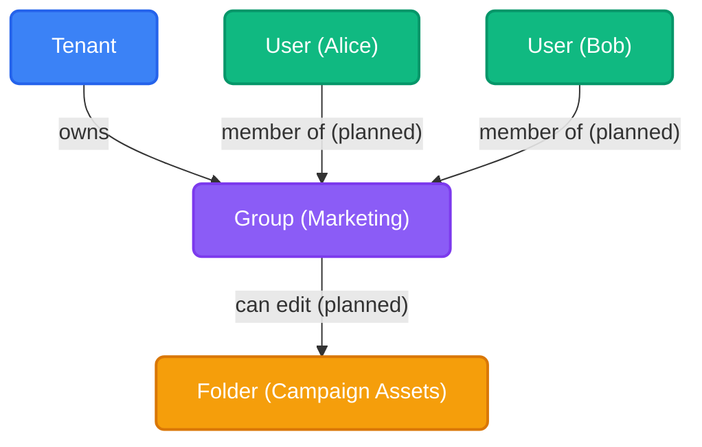
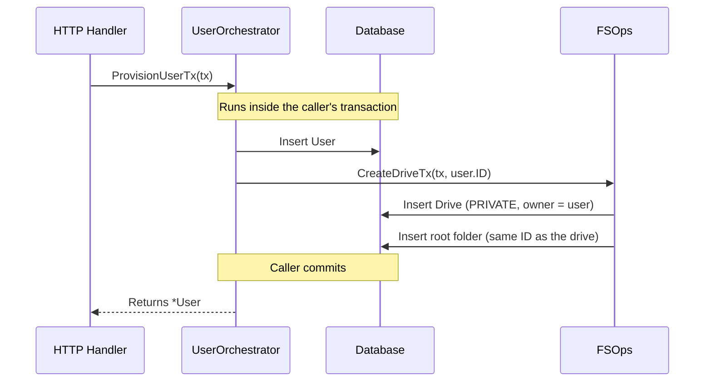

import { Accordion, Accordions } from 'fumadocs-ui/components/accordion';

Users and Groups are the foundational identities within Platrium. They are stored in the [relational database](../database/overview), where uniqueness, referential integrity and transactions are enforced by the schema itself.

## The User Model

Every user in Platrium is a row in the `users` table, and they belong to exactly one Tenant.

```json
{
  "id": "V1StGXR8_Z5jdHi6B-myT",
  "tenantId": "k8Gq2Zr0oXb4TnE1cU7aW",
  "idpId": "Pq3VnHs9LmA2eDyR6tXzJ",
  "externalId": "104293847291",
  "email": "admin@acme.com",
  "displayName": "Admin",
  "role": "SUPER_ADMIN",
  "createdAt": "2026-10-03T14:20:00Z",
  "disabledAt": null,
  "sessionsValidAfter": null
}
```

`role` says what the user may administer, see [roles and permissions](../authz/permissions). `disabledAt` is set when an administrator blocks the account: the user keeps their data and identity but cannot sign in, and every session and token they hold stops working. Re-enabling restores them. `sessionsValidAfter` is the moment before which every session and token the user was issued is void, set by things like a password reset, see [from request to identity](../authn/requests-and-sessions#signing-a-user-out-everywhere).

A user is identified on the platform by the pair `(idpId, externalId)`: the IdP that authenticated them and their subject at that IdP. A unique constraint guarantees one user per pair. External IDs are compared byte-for-byte, because identity providers treat them as case-sensitive.

### Minimal Profile Data Design

You might notice that the `User` row is extremely lightweight. We deliberately only store `email` and `displayName`, ignoring extended profile data like phone numbers, physical addresses, or job titles.

<Accordions>
  <Accordion title="Why keep the user profile so minimal?">
    Platrium is fundamentally a distributed storage and collaboration engine, not a Human Resources tool or an SSO Identity Provider (IdP). 
    
    We only store the bare minimum information required to power the core user experience:
    1. **Sharing**: When typing in a "Share File" dialogue, the UI needs an email and name to populate the autocomplete dropdown.
    2. **Sorting & Listing**: When a Tenant Admin views the "Members" table, they need a bird's-eye view of who is in their workspace.
    
    If a workspace uses Okta or Google Workspace, those systems remain the source of truth for rich profile data. Storing it in Platrium just creates syncing headaches.
  </Accordion>
</Accordions>

## The Group Model

Groups are collections that users can be assigned to for bulk authorization (e.g., granting folder access to an entire team). A group mirrors a group from an IdP, so it is unique per `(idpId, externalId)` and belongs to one tenant.

```json
{
  "id": "Zk4PqW7nB2xRtYc9LdMeH",
  "tenantId": "k8Gq2Zr0oXb4TnE1cU7aW",
  "idpId": "Pq3VnHs9LmA2eDyR6tXzJ",
  "externalId": "marketing",
  "name": "Marketing Team",
  "createdAt": "2026-10-03T14:20:00Z"
}
```

:::info
**Planned**
Group membership and access grants (who is in a group, and what a group may edit) are part of the upcoming authorization work and are not implemented yet. The diagram below shows the intended shape: memberships and grants become rows in association tables.
:::



## IdP Linking (Single Source of Truth)

The `users` table has an `idp_id` column that maps the user back to the specific Identity Provider (like Google Workspace, Okta, or Local Auth) that controls their authentication. It is a **foreign key** to `idp_providers`, with a unique index on `(idp_id, external_id)`.

<Accordions>
  <Accordion title="Why a foreign key with an index?">
    The link is stored exactly once, as a column. There is no second copy that could drift out of sync (for example a separate "authenticates via" relationship that a migration script forgets to update).

    The foreign key makes the database guarantee that every user points at a real IdP, and that an IdP cannot be deleted while users still reference it (`RESTRICT`). The index makes the most frequent operation, a login looking up `(idp_id, external_id)`, a single indexed lookup. Finding all users of an IdP (needed for the rare IdP migration or deletion) uses the same index.
  </Accordion>
</Accordions>

## The User Orchestrator

Because a user spans several domains (identity, credentials, storage), users are not just inserted into a table. All user provisioning and deprovisioning is guarded by the **`UserOrchestrator`** (located in `engine/internal/orchestrator/user.go`).

### Provisioning Flow

When a new user is created (either via Admin invite or JIT SCIM provisioning), the `UserOrchestrator` coordinates across multiple domains within a single database transaction.



By explicitly passing the `*ent.Tx` down into the Storage engine (`FSOps`), we guarantee that the User's identity and their underlying storage structure are created atomically. If the drive fails to provision, the user account creation completely rolls back. Creating a drive also verifies the owner belongs to the same tenant as the drive.

### Deprovisioning & Background Deletes

If a Tenant Admin deletes an IdP connection (e.g., removing a legacy Okta integration), we **do not** rely on a database-level cascading delete to wipe out the users. Foreign keys are `RESTRICT`, so the database refuses to delete an IdP that still has users.

Because a User is a distributed entity, a blind cascade would leave gigabytes of orphaned zombie data in the object storage and KV stores.

Instead, when an IdP is deleted:
1. The system queries the index for all associated users (`WHERE idp_id = ?`).
2. It pushes those user IDs into a background worker queue.
3. The background worker calls the `UserOrchestrator.DeprovisionUser()` workflow.
4. The Orchestrator systematically tears down their credentials, triggers the Storage Engine to aggressively garbage-collect their drives, and *finally* deletes the user row. Once no users remain, the IdP itself can be removed.
