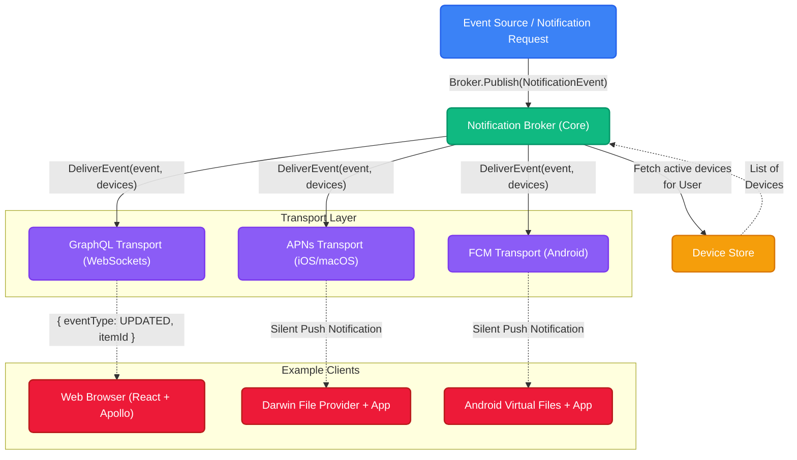

import { Accordion, Accordions } from 'fumadocs-ui/components/accordion';

Normally, real-time synchronization requires tight coupling between your database mutations and your WebSocket servers or push notification services. But with Platrium, we take a decoupled approach.

We leverage a central **Notification Broker** that acts as the single source of truth for all system events. By intercepting internal domain events (like a file being created or deleted) and routing them through a pure Go broker, we can fan out thousands of events to different clients (Web, macOS) without the core file system engine ever knowing what a "WebSocket" or an "APN" is!

Under the hood, the `NotificationBroker` accepts pure domain structs (like `events.DriveEvent`), resolves the target users, maps them to their active devices, and concurrently dispatches the events to registered **Transports**.

## The Architecture

Here is a high-level look at how the GraphQL Resolvers, the Notification Broker, the Device Store, and our Transports all tie together to synchronize state across platforms:

## Devices & User Mapping

:::info
**Architecture Philosophy:** A `Device` cannot exist in the universe without a `User` owning it.
:::

When an event is published, the Broker only receives a list of `UserIDs`. But how does it know whether to send a WebSocket ping to Chrome or an Apple Push Notification (APN) to a Macbook?

This is where the **Device Store** comes in. Every time a user signs a native app in (iOS, macOS, Android), we register a `Device` record bound to their `UserID`, created together with the token the app signs in with (see [Native Clients](/architecture/authn/native-clients)). The app then registers its APNs or FCM token against that device. 
- For Apple platforms, the device stores the unique APNs token (`push_transport` = `APNS`, `push_token`).
- For the Web, the GraphQL connection itself registers an ephemeral listener.

When `Broker.Publish(ctx, userIDs, event)` is called, the Broker queries the `DeviceStore` to resolve exactly which physical devices belong to those users, and fans the event out accordingly.

## The Transport Layer

Once the Broker knows *who* should receive the event and *what* devices they own, it passes the baton to the **Transports**. 

Transports are isolated modules that implement the `NotificationTransport` interface. Their only job is to take a pure Go domain event (like `EventUpdated`) and translate it into the specific wire format required by the client.

We currently maintain three primary transports:
1. **[The GraphQL Transport](./graphql-transport)**: Handles translating events into GraphQL models and broadcasting them over WebSockets to the React frontend.
2. **The APNs Transport**: Handles constructing Apple-compliant push payloads and dispatching them through the HTTP/2 APNs provider API to wake up the macOS File Provider Extension.
3. **The FCM Transport**: Handles pushing data payloads through Firebase Cloud Messaging to synchronize the Android Virtual Files app.