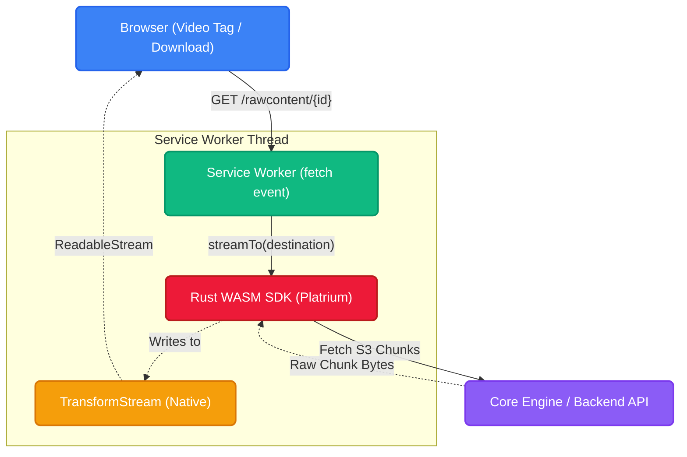

import { Accordion, Accordions } from 'fumadocs-ui/components/accordion';

Normally, downloading massive files or streaming videos in a web browser requires routing all the traffic through a heavy Node.js proxy server. But with Platrium, we do things differently.

We leverage a **Service Worker** to act as a virtual server living entirely *inside* your browser! By intercepting regular HTTP requests and wiring them directly to our Rust WASM SDK, we achieve native-speed downloads and zero-buffering video playback with absolutely zero intermediate proxy servers!

Under the hood, the Rust SDK concurrently downloads the individual CAS (Content Addressable Storage) chunks using presigned URLs provided directly by the storage backend. 
These chunks are seamlessly stitched together inside the [SDK's download pipeline](../../sdk-internals/net/processing-downloads), and then immediately flushed into the native Web Streams API provided by the Service Worker.

## The Architecture

Here is a high-level look at how the browser, the Service Worker, and our WASM SDK all tie together to stream bytes directly from the backend to the user's screen:

## Request Interception & Streams

:::info
**Debugging Tip:** Because the Service Worker runs invisibly, its logs do not appear in the normal web console! To see the custom `loglevel` logs, you must explicitly open the Application > Service Workers tab in your DevTools and click "Inspect" to view the isolated background thread.
:::

When the web app wants to display a file (like an inline PDF or a Video tag), it simply sets the `src` to `/rawcontent/{fileId}`. 

The Service Worker intercepts this `fetch` event. Instead of letting the browser look for a real server, the worker:
1. Instantiates a `PlatriumClient` and requests a `DownloadSession` via WASM.
2. Creates a native JavaScript `TransformStream`.
3. Passes the `WritableStream` destination down into the Rust SDK.
4. Immediately returns a `new Response(readableStream)` back to the browser!

To the browser, it looks like a normal HTTP response. But under the hood, the Rust SDK is concurrently pulling down chunks from the backend and pumping those bytes directly into the stream!

### The Unicode Headers Trap

One notorious edge-case we handle is the HTTP Headers specification. Browsers are fully UTF-8, but HTTP Headers are strictly ASCII. 

If a user uploads a file with a Unicode character (like the invisible *Narrow No-Break Space* in Mac screenshots), trying to inject that into `Headers.set('Content-Disposition', '...')` will instantly crash the Service Worker with a `ByteString TypeError`!

To fix this, we implement the **RFC 5987** standard. We scrub out all non-ASCII characters for the legacy `filename="..."` fallback, and pass the perfectly preserved, URL-encoded Unicode filename to the modern `filename*=UTF-8''...` parameter.

## Range Requests & Video Scrubbing

Streaming a 30-second video is easy—the browser just downloads the whole file via a standard `200 OK`. But what happens when a user wants to skip to the middle of a 2GB movie?

When the user scrubs the video timeline, the browser aborts the current request and fires a brand new request with an HTTP **Range Header** (e.g., `Range: bytes=1000000-`).

The Service Worker intercepts this and does some crucial math:
1. Parses the requested `start` and `end` bytes.
2. Bounds the `end` byte against the `session.fileSize`.
3. Returns a `206 Partial Content` HTTP status code.
4. Sets the `Content-Range: bytes {start}-{end}/{total}` header.

Finally, instead of triggering a full download, the Service Worker calls `session.streamRangeTo(destination, start, end)`. The Rust SDK intelligently calculates exactly which chunk indices overlap with that byte range, fetches *only* those specific chunks, and streams the exact byte slice back to the video player! 

## The `event.waitUntil()` Lifeline

Because Service Workers run in a background thread, the browser aggressively tries to kill them to save battery and RAM.

Once the `respondWith(new Response(...))` function returns, the browser thinks the Service Worker is completely finished. If our Rust SDK is still running in the background fetching chunks via `reqwest`, the browser will violently terminate the network sockets, resulting in a catastrophic `TypeError: NetworkError when attempting to fetch resource`!

To solve this, we leverage the `event.waitUntil()` lifeline. By passing our background `streamTo()` promise into `waitUntil()`, we strictly guarantee that the Service Worker stays alive and the network sockets remain open exactly as long as the stream is pumping bytes!