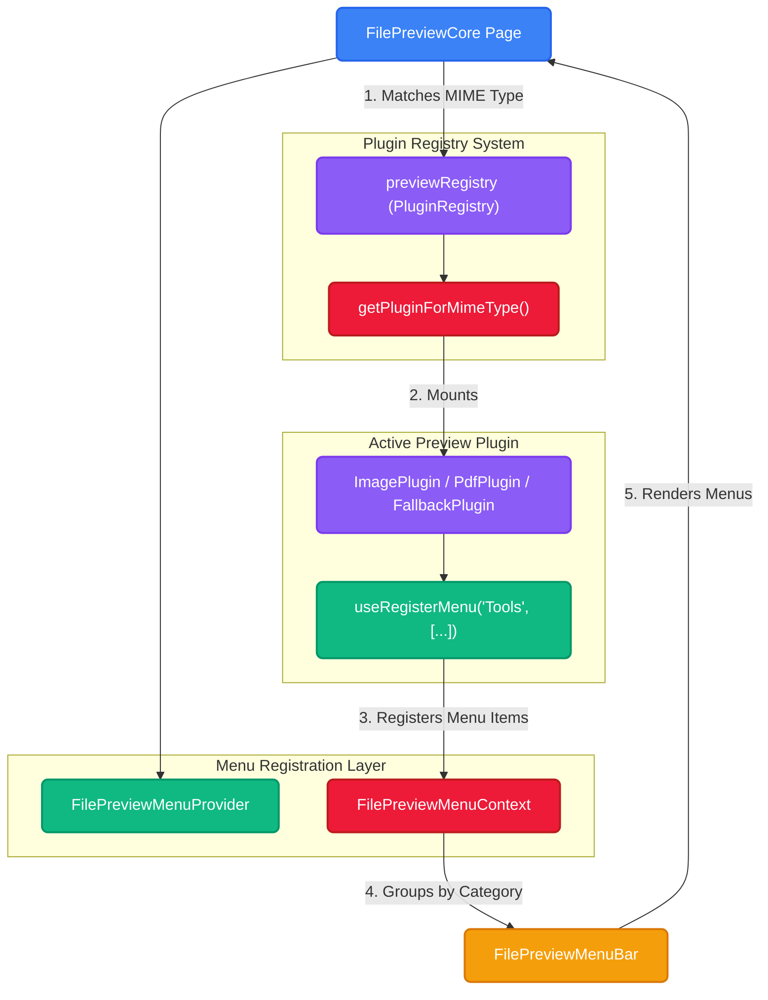
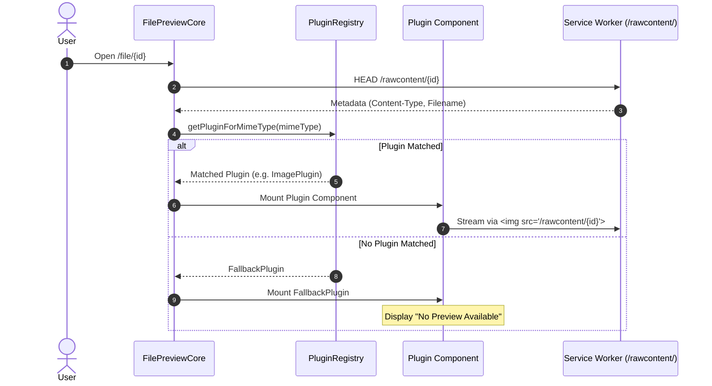

import { Accordion, Accordions } from 'fumadocs-ui/components/accordion';
import { Tabs, Tab } from 'fumadocs-ui/components/tabs';

Viewing files directly in the browser shouldn't mean loading a monolith that tries to handle every file format under the sun. Whether it's a PDF, a high-res image, an MP4 video, or a raw text file, Platrium uses a **modular plugin architecture** to render rich file previews with dedicated toolbar controls and context menus!

## Plugin & Menu Architecture

Platrium separates file previewing into two distinct systems: **Plugin Registration** (which plugin renders which MIME type) and **Menu Registration** (how plugins contribute commands to the top Menubar and Context Menu).



### Plugin Registration (`PluginRegistry`)

Every preview plugin implements the `PluginDefinition` interface, declaring its supported MIME types (exact strings like `application/pdf` or wildcard patterns like `image/*`):

```ts
export interface PluginDefinition {
  id: string;
  name: string;
  supportedMimeTypes: string[]; // e.g. ["image/*", "application/png"]
  maxSizeBytes?: number; // max size in bytes (undefined = 32MB default limit, 0 = unlimited)
  component: ComponentType<FilePreviewPluginProps>;
}
```

Plugins register with the global `previewRegistry` instance (`previewRegistry.register(ImagePlugin)`). When a file is loaded, `previewRegistry.getPluginForMimeType(mimeType)` finds the matching handler and caches the lookup for O(1) evaluation. If no plugin matches, it returns `FallbackPlugin`.

#### Preview File Size Limits (`maxSizeBytes`)

To prevent non-range plugins from crashing browser memory with huge files (like a 500MB PNG image), Platrium enforces file size limits during the initial `HEAD /rawcontent/{id}` call:
- **Default Limit (`32 MB`)**: If a plugin omits `maxSizeBytes` (leaves it `undefined`), `FilePreviewCore` applies `DEFAULT_MAX_PREVIEW_SIZE_BYTES` (32 MB).
- **Custom Plugin Limit**: Plugins can specify custom limits (e.g. `ImagePreviewPlugin` specifies `25 * 1024 * 1024` = 25 MB).
- **Unlimited (`0`)**: Setting `maxSizeBytes: 0` specifies that the plugin supports progressive/range-based streaming (e.g. `VideoPlugin`) and has no size cap.
- **Fallback Trigger**: If `sizeBytes > maxSizeBytes`, `FilePreviewCore` renders `FallbackPlugin` displaying a **"File Too Large to Preview"** warning with a manual download button.

### Menu Registration (`FilePreviewMenuContext`)

Instead of hardcoding toolbar buttons, menu contributions are fully reactive:
1. `FilePreviewCore` wraps the previewer with `<FilePreviewMenuProvider>`.
2. `FilePreviewMenuBar` registers core defaults (`Download`, `File Info`) under the `File` category using `useRegisterMenu("File", [...])`.
3. The active plugin calls `useRegisterMenu("Tools", [...])` or `useRegisterMenu("View", [...])` directly inside its component body.
4. `FilePreviewMenuBar` groups registered items by category and renders the top Menubar and right-click `ContextMenu`.
5. On plugin unmount, `useRegisterMenu` automatically cleans up the plugin's items.

:::info
**Loop Safety**: `FilePreviewMenuProvider` uses deep-equality checks on item properties and memoizes the context value. Inline array definitions in plugin renders will not cause re-render loops!
:::

## Metadata Resolution & Direct Streaming

Platrium fetches file metadata first via HTTP HEAD before initializing plugins or streaming content.



### Metadata Resolution via HTTP HEAD

When navigating to `/file/:id`, `FilePreviewCore` executes a lightweight **HTTP HEAD** request to `/rawcontent/{fileId}`. 

The Service Worker responds instantly with response headers containing:
- `Content-Type` (e.g. `image/png`, `application/pdf`)
- `Content-Length` (file size in bytes)
- `Content-Disposition` (original filename)

This allows `FilePreviewCore` to pick the right plugin without downloading any file body payload upfront!

### Direct Streaming via `/rawcontent/`

Plugins render media elements by pointing directly to `/rawcontent/{fileId}`. The Service Worker intercepts these requests and fulfills them seamlessly.

## Default Core Plugins

Platrium ships with a set of default core plugins that handle the most common file formats natively in the browser without any backend transcoding.

<Tabs items={['PDF', 'Image', 'Video', 'Audio']}>
<Tab value="PDF">
The PDF plugin uses Mozilla's `pdf.js` under the hood. It leverages the Service Worker's ability to intercept HTTP range requests, allowing `pdf.js` to intelligently download only the necessary byte chunks of the document as the user scrolls, rather than loading the entire file into memory at once! It supports fully interactive text layers, hyperlinked annotations, and virtualized page rendering.
</Tab>
<Tab value="Image">
The Image plugin streams raw image formats (`image/*`) directly into a standard HTML `` tag via the Service Worker intercept. It features a custom zoom and rotation control panel, and it gracefully enforces a maximum payload limit (e.g. 25MB) to prevent browser memory crashes on massive uncompressed images.
</Tab>
<Tab value="Video">
The Video plugin supports all browser-native video codecs (`video/*`). By streaming the raw content URL into a `<video>` tag, the browser's native media engine seamlessly fires byte-range HTTP requests to the Service Worker. This allows for instant scrubbing, jumping, and progressive playback without downloading the entire video payload.
</Tab>
<Tab value="Audio">
Similar to the Video player, the Audio plugin handles `audio/*` MIME types using an `<audio>` tag. It provides a customized control interface (with an animated pulsing visualizer) while fully relying on the browser's native HTTP range requests for seamless timeline scrubbing and buffering.
</Tab>
</Tabs>

### Service Worker Range Requests

Because Platrium's Service Worker acts as a virtual network layer, it automatically translates browser-native HTTP `Range` requests into SDK-level chunk streams. This allows the PDF, Video, and Audio plugins to seek instantly:

```log title="Console Logs"
logging.ts:17 [Platrium SW] Intercepted GET download request for fileId: a3d71ac7-1c4a-43d1-9667-3f9a449db81b
logging.ts:17 [Platrium SW] Requesting download session...
logging.ts:17 [Platrium SW] Download session created successfully: {fileName: 'Sky.mp3', mimeType: 'audio/mpeg', fileSize: 14548465}
logging.ts:17 [Platrium SW] Range header present: bytes=13139968-
logging.ts:17 [Platrium SW] Creating TransformStream...
logging.ts:17 [Platrium SW] Destination created successfully.
logging.ts:17 [Platrium SW] Triggering Range Download: bytes 13139968-14548464...
logging.ts:17 [Platrium SW] Returning 206 Partial Content Response
logging.ts:17 [Platrium SW] SDK streamRangeTo finished successfully. Closing writable stream.
```

## Building a Custom Preview Plugin

Here is a complete example showing how to build an `ImagePreviewPlugin` that streams an image directly via `/rawcontent/` and registers custom menu items:

```tsx
import React, { useState } from "react";
import type { FilePreviewPluginProps, PluginDefinition } from "../PluginDefinition";
import { useRegisterMenu } from "../FilePreviewMenuContext";
import { previewRegistry } from "../PluginRegistry";
import { RotateCw, ZoomIn, ZoomOut } from "lucide-react";

export const ImagePluginComponent: React.FC<FilePreviewPluginProps> = ({ info }) => {
    const [rotation, setRotation] = useState(0);

    // 1. Register custom menu items for Tools and View categories
    useRegisterMenu("Tools", [
        {
            id: "img-rotate",
            label: "Rotate Clockwise",
            category: "Tools",
            icon: RotateCw,
            shortcut: "⌘R",
            onClick: () => setRotation((r) => (r + 90) % 360),
        },
    ]);

    useRegisterMenu("View", [
        {
            id: "img-zoom-in",
            label: "Zoom In",
            category: "View",
            icon: ZoomIn,
            shortcut: "⌘+",
            onClick: () => {
                /* Custom zoom logic */
            },
        },
    ]);

    // 2. Stream image directly via /rawcontent/{fileId}
    const rawContentUrl = `/rawcontent/${info.fileId}`;

    return (
        <div className="flex items-center justify-center h-full w-full p-4 overflow-hidden">
            
        </div>
    );
};

// 3. Define Plugin supporting image wildcard MIME types
export const ImagePlugin: PluginDefinition = {
    id: "image-previewer",
    name: "Image Previewer",
    supportedMimeTypes: ["image/*"],
    maxSizeBytes: 25 * 1024 * 1024, // 25 MB max limit (undefined = 32MB default, 0 = unlimited)
    component: ImagePluginComponent,
};

// 4. Register with global PluginRegistry
previewRegistry.register(ImagePlugin);
```

<Accordions>
<Accordion title="How does MIME type wildcard matching work?">
When `previewRegistry.getPluginForMimeType("image/png")` is called, it checks exact matches first, then tests wildcard patterns like `image/*`. The first matching plugin in the registry is selected.
</Accordion>
<Accordion title="Can plugins render overlay controls?">
Yes! Plugins own their full container below the top menubar. You can render floating toolbars, pagination pills, or zoom sliders anywhere using absolute positioning.
</Accordion>
</Accordions>