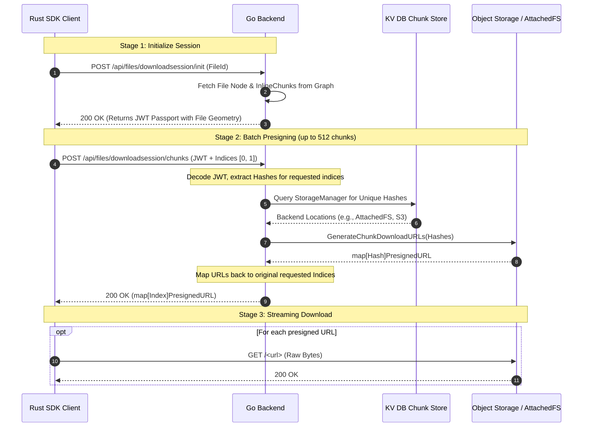

Downloading a file efficiently at scale is just as complex as uploading. You need to stream massive files, support pausing/resuming, and securely route requests to potentially different storage backends—all without crushing the primary Graph database.

To achieve this, Platrium uses a **Download Session Flow** powered by intelligent JWT passports and a highly optimized index-to-hash mapping engine.

This document breaks down exactly how the Go Backend processes a download session from start to finish.

## The Protocol Flow

:::warning
Authentication Middleware and Authorization Flows are not implemented at the time of writing this document. This section assumes the user is authenticated and authorized to download the file.
:::



## Stage 1: The JWT Passport

When a client wants to download a file, they hit `POST /api/files/downloadsession/init` with the `file_id`. 

To initiate the download, the backend queries the Neo4j Graph Database to find the file. Because 99% of normal user files are under 16MB (4 chunks), Platrium natively stores the file's geometry (the array of chunk hashes) directly on the File Node property as an `InlineChunks` array.

Instead of keeping this connection open or forcing the client to query the graph database for every chunk, the backend mints a **Download Session Passport**—a cryptographically signed JSON Web Token (JWT) containing the `InlineChunks` array:

```go
type DownloadSessionPassportClaims struct {
	FileID       string   `json:"file_id"`
	Version      string   `json:"version"`
	InlineChunks []string `json:"inline_chunks"`
	jwt.RegisteredClaims
}
```

The client receives this JWT and uses it for the rest of the download lifecycle. 

:::info
**Files > 16MB (Manifest Repo)**
If a file is larger than 4 chunks, Neo4j will store `[]` (an empty array), and the JWT will simply be minted with a `null` value for `inline_chunks`. In Stage 2, the backend will dynamically fallback to reading the structural geometry from the high-performance `ManifestRepo` instead!
:::

## Stage 2: Batch Presigning & Index Mapping

The client needs to download chunks sequentially to reconstruct the file. It sends a batch of requested indices (e.g., `{"indices": [0, 1, 2]}`) along with the JWT passport to `POST /api/files/downloadsession/chunks`.

### 1. Zero-Graph Resolution
The backend verifies the JWT and decodes the payload. It extracts the client's requested indices and maps them directly to the `InlineChunks` array embedded in the token. 
*Example: Index `0` -> `hashA`, Index `1` -> `hashB`.*

Because the data is securely sealed in the JWT, **the backend never queries the Graph database!**

### 2. Algorithmic Deduplication
Files are often heavily deduplicated. It's very possible that index `0` and index `50` in the same file are the exact same chunk hash. 

Before asking the storage backend for URLs, the handler extracts only the *unique* hashes from the requested indices. This incredibly lean $O(N)$ loop guarantees that the backend won't perform redundant database queries or generate duplicate URLs for identical chunks in the same batch.

### 3. StorageManager Routing
The deduplicated `[]string` of unique hashes is passed to the `StorageManager`. 
The manager performs a multi-get query on the BadgerDB KV Store to fetch the `ChunkMetadata` for each hash. This metadata tells the manager *which* specific storage backend (e.g., `s3`, `attachedfs`) is actually holding the bytes.

The manager routes the hashes to the correct backend driver, which natively generates highly-scalable, stateless Presigned URLs for direct download.

### 4. Index-to-URL Response
The `StorageManager` returns a map of `hash -> URL`. The handler iterates through the original list of requested indices one last time, looking up the URL for the corresponding hash, and builds the final JSON response:

```json
{
  "chunks": {
    "0": {
      "download_url": "http://localhost:3000/api/attachedfs/download/hashA?expires=..."
    },
    "1": {
      "download_url": "http://localhost:3000/api/attachedfs/download/hashB?expires=..."
    }
  }
}
```

## Stage 3: Streaming Download

Armed with the direct presigned URLs, the client initiates concurrent `GET` requests to stream the raw bytes from the Object Storage or Attached File System. 

Because the backend provided the URLs mapped directly to the indices, the SDK can stitch the incoming byte streams together into a perfect replica of the original file, all without the central Platrium engine touching a single byte of file data!