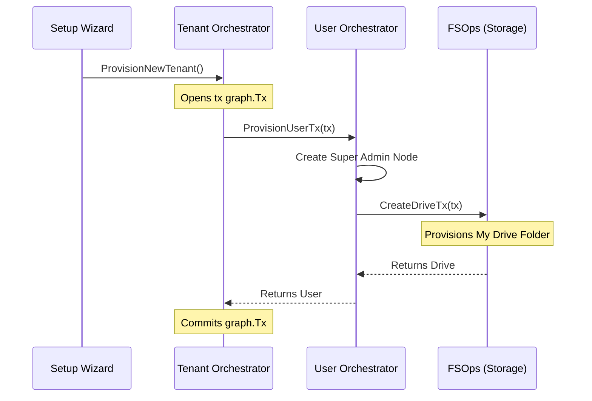

import { Accordion, Accordions } from 'fumadocs-ui/components/accordion';

:::warning
**Active Development**
The orchestration flows documented here are actively being developed and refined. While this document represents the target state of the architecture, specific function names or transaction steps may change as the codebase evolves. 
:::

When a completely fresh instance of Platrium is booted for the very first time, the cluster is effectively a blank slate. It has absolutely no data, no authentication boundaries, and no users. 

To bring the cluster online and make it usable, the system automatically triggers the **Initial Setup Flow** via the API. This flow is strictly orchestrated by the `TenantOrchestrator` and is responsible for provisioning the foundational "Native Tenant" alongside the overarching cluster Super Admin.

## The Dual-Write Orchestration Flow

Because Platrium spans a Graph Database (AuthZ & Structure), a KV Store (AuthN Passwords), and a Distributed File System (Storage), creating the very first workspace is not a simple SQL `INSERT`. It is a complex, multi-system orchestration.

We leverage an atomic pattern to ensure that if any step fails (e.g., the DB crashes mid-setup, or the storage engine is offline), the entire cluster safely rolls back without leaving behind orphaned, unmanageable data.

### Step 1: Pre-provision the KV Secrets

The absolute first action is interacting with the `LocalUserStore` (the KV Store) to hash the Super Admin's password. 

Instead of writing this permanently and risking an orphaned hash if the Graph DB fails, the orchestrator creates a **Temporary User** with a strict 10-minute Time-To-Live (TTL):

```go
m.localUserStore.CreateTemporaryUser(ctx, userId, adminPassword, 10*time.Minute)
```

If the setup crashes here, or anywhere downstream, this temporary hash will silently evaporate on its own.

### Step 2: The Monolithic Graph Transaction

Next, the orchestrator opens a single, monolithic `WriteTx` network connection to the Graph Database. **All** subsequent structural changes happen deep inside this isolated transaction bubble.

1. **Create the Native Tenant Node:** The `Tenant` node is provisioned and explicitly flagged as `isNative: true`.
2. **Create the Local IdP:** A default `IdpConnection` node is created, representing the Platrium Local Authentication system.
3. **Link the Tenant to the IdP:** The system draws the `(t)-[:USES_IDP]->(i)` edge, establishing the authorization baseline.

### Step 3: The User Orchestrator Handoff

Still deep inside that exact same Graph transaction, the `TenantOrchestrator` delegates control to the [User Orchestrator](../architecture/identity/users-groups).



4. **Create the Super Admin User:** The `UserOrchestrator` provisions the `User` node and assigns its `idpId` property to the newly created Local IdP.
5. **Create the Private Drive:** The `UserOrchestrator` interfaces directly with the `FSOps` engine (`o.fsOps.CreateDriveTx()`), passing the *exact same transaction pointer*. It creates the root "My Drive" folder node for the Super Admin and flawlessly draws the `[:OWNS]` edge.
6. **Elevate to Super Admin:** Finally, control unwinds back to the Tenant Orchestrator, which draws the absolute highest authorization edge in the system: `(t)-[:HAS_USER {role: "SUPER_ADMIN"}]->(u)`.

<Accordions>
  <Accordion title="Why pass the Transaction pointer down the chain?">
    By explicitly passing the `tx graph.Tx` pointer from the `TenantOrchestrator`, down to the `UserOrchestrator`, and finally down to `FSOps`, we bind three entirely separate domain boundaries into a single atomic block. 
    
    If the Storage engine fails to create the Private Drive, it returns an error. This error ripples up the chain, causing the `WriteTx` wrapper to instantly issue a native `ROLLBACK` command to the GraphDB. The Tenant, IdP, and User nodes are wiped from memory as if they never existed!
  </Accordion>
</Accordions>

### Step 4: Finalize the User

If the Graph Database successfully commits the massive transaction, the orchestrator's final action is to lock in the password.

It calls `m.localUserStore.FinalizeTemporaryUser(ctx, userId)`. This reaches back into the KV Store, strips the 10-minute TTL off the initial password hash, and writes it back to disk permanently. 

The Native Tenant is now fully online, the Super Admin can seamlessly log in, and the cluster is officially ready for production traffic!