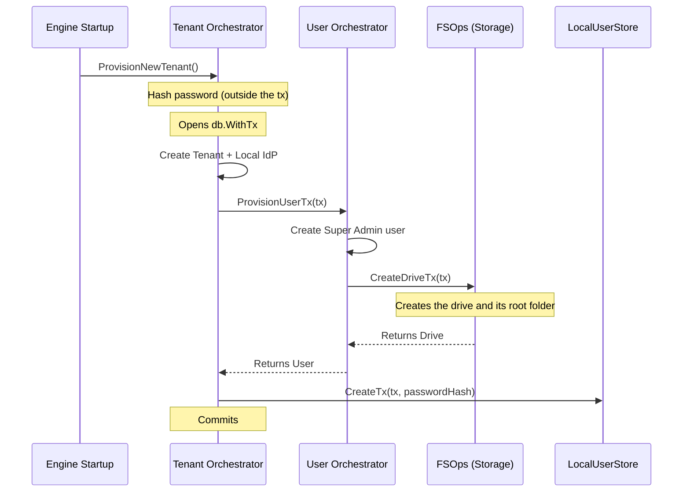

import { Accordion, Accordions } from 'fumadocs-ui/components/accordion';

:::warning
**Active Development**
The orchestration flows documented here are actively being developed and refined. While this document represents the target state of the architecture, specific function names or transaction steps may change as the codebase evolves. 
:::

When a completely fresh instance of Platrium is booted for the very first time, the cluster is effectively a blank slate. It has absolutely no data, no authentication boundaries, and no users. 

To bring the cluster online and make it usable, the engine automatically runs the **Initial Setup Flow** at startup. This flow is strictly orchestrated by the `TenantOrchestrator` and is responsible for provisioning the foundational "Native Tenant" alongside the overarching cluster Super Admin.

## One Transaction to Rule Them All

Creating the very first workspace touches several domains: tenants, identity providers, users, local credentials and the storage tree. They all live in the same [relational database](../architecture/database/overview), so the whole flow is **one database transaction**. If any step fails (a constraint is violated, the drive can't be created, the process crashes), everything rolls back and nothing is left behind.

### Step 1: Hash the Password

The first action is hashing the Super Admin's password with bcrypt. This happens **before** the transaction opens: bcrypt is deliberately slow, and we don't want to hold a database connection while it runs.

```go
passwordHash, err := local.HashPassword(adminPassword)
```

Nothing has been written anywhere yet, so there is nothing to clean up if this fails.

### Step 2: Open the Transaction

The orchestrator opens a single transaction with `db.WithTx`. **All** subsequent changes happen inside it.

1. **Create the Native Tenant:** The `Tenant` row is created and flagged as native. A unique constraint guarantees only one native tenant can ever exist, even if two instances race to create it.
2. **Create the Local IdP:** A default `LOCAL` `IdpProvider` row is created for the tenant, representing the Platrium Local Authentication system.

### Step 3: The User Orchestrator Handoff

Still inside that same transaction, the `TenantOrchestrator` delegates to the [User Orchestrator](../architecture/identity/users-groups).



3. **Create the Super Admin User:** The `UserOrchestrator` creates the `User` row, bound to the new Local IdP, with the `SUPER_ADMIN` role set from the start.
4. **Create the Private Drive:** The `UserOrchestrator` calls `FSOps.CreateDriveTx()` with the *exact same transaction*. It creates the `Drive` (owned by the Super Admin) and its root "My Drive" folder.
5. **Store the Password:** Finally, the `LocalUserStore` writes the bcrypt hash as a `LocalCredential` row, in the same transaction.

<Accordions>
  <Accordion title="Why pass the transaction down the chain?">
    By explicitly passing the `*ent.Tx` from the `TenantOrchestrator`, down to the `UserOrchestrator`, and finally down to `FSOps` and the `LocalUserStore`, we bind separate domain boundaries into a single atomic block. 
    
    If any of them fails, the error ripples up the chain, causing `WithTx` to issue a native `ROLLBACK`. The Tenant, IdP, User, Drive and password are all gone as if they never existed.
  </Accordion>
  <Accordion title="What does a failure look like?">
    Uniqueness is enforced by the database schema, so a duplicate alias (or a second native tenant) surfaces as `identity.ErrConflict`. After the rollback, the orchestrator reads why (alias taken vs native tenant exists) and returns a specific message.
  </Accordion>
</Accordions>

## Done

When the transaction commits, the Native Tenant is fully online, the Super Admin can immediately log in (their password committed together with their account), and the cluster is ready for production traffic. There is no "finalize" step and no temporary state to expire.
