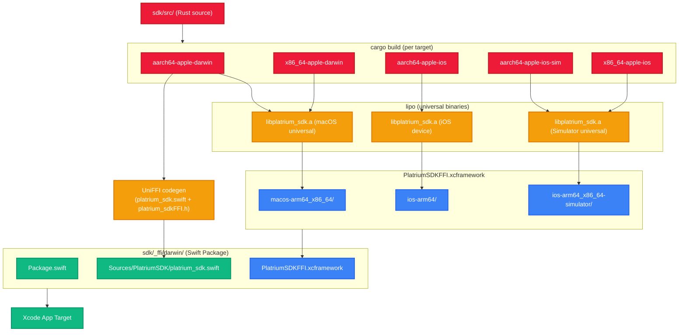

import { Accordion, Accordions } from 'fumadocs-ui/components/accordion';
import { Tabs, Tab } from 'fumadocs-ui/components/tabs';

The Apple Darwin platform target is the SDK distribution for **macOS**, **iOS**, and **iPadOS** — covering both Apple Silicon and Intel Macs, physical iPhone/iPad devices, and simulators. It produces a single, distributable **XCFramework + Swift Package** that an Xcode project can consume with a single local package import!

## Platform Support Matrix

| Platform | Architecture | Minimum Version |
|---|---|---|
| macOS | arm64 (Apple Silicon) | **macOS 11.0** Big Sur |
| macOS | x86_64 (Intel) | **macOS 11.0** Big Sur |
| iOS / iPadOS | arm64 (Physical Device) | **iOS 16.0** |
| iOS Simulator | arm64 (Apple Silicon Mac) | **iOS 16.0** |
| iOS Simulator | x86_64 (Intel Mac) | **iOS 16.0** |

## How It All Fits Together

The SDK is a **Rust crate** at its core. On Apple platforms, it compiles to a native static library (`.a`) for each target, which gets bundled into a single **XCFramework**. UniFFI auto-generates the Swift glue layer so you can call into it from Xcode like regular Swift code.



## Required Toolchain

To build the Darwin SDK, you need **Rust stable** with all Apple targets installed. The `sdk/rust-toolchain.toml` pins this automatically — `rustup` picks it up without any manual steps:

```toml title="sdk/rust-toolchain.toml"
[toolchain]
channel = "stable"
components = ["rustfmt", "clippy"]
targets = [
    # macOS (Apple Silicon + Intel)
    "aarch64-apple-darwin",
    "x86_64-apple-darwin",

    # iOS & iPadOS (Physical devices)
    "aarch64-apple-ios",

    # iOS & iPadOS Simulators (Apple Silicon + Intel)
    "aarch64-apple-ios-sim",
    "x86_64-apple-ios",
]
```

You also need **Xcode** installed (for `xcodebuild`, `lipo`, and the iOS SDKs) and **UniFFI** (pulled in as a Cargo dependency — no separate install needed).

## The Build Script

Everything is orchestrated by `sdk/scripts/build_darwin.sh`. Run it via Nx:

```bash
nx run sdk:build:darwin
```

### Step 1 — Compile for All Targets

Each target gets its own scoped `cargo build` with the deployment target set **inline as an env var**. This is critical — setting it globally (e.g. via `.cargo/config.toml`) contaminates build scripts for proc macros that run on the host machine, causing cryptic linker failures!

```bash title="sdk/scripts/build_darwin.sh"
MACOSX_DEPLOYMENT_TARGET=11.0 cargo build --release --target aarch64-apple-darwin
MACOSX_DEPLOYMENT_TARGET=11.0 cargo build --release --target x86_64-apple-darwin

IPHONEOS_DEPLOYMENT_TARGET=16.0 cargo build --release --target aarch64-apple-ios
IPHONEOS_DEPLOYMENT_TARGET=16.0 cargo build --release --target aarch64-apple-ios-sim
IPHONEOS_DEPLOYMENT_TARGET=16.0 cargo build --release --target x86_64-apple-ios
```

### Step 2 — Generate Swift Bindings

UniFFI inspects the compiled macOS ARM64 library and spits out two things:

- `platrium_sdk.swift` — the high-level Swift wrapper (types, async methods, errors, etc.)
- `platrium_sdkFFI.h` — the low-level C bridge header with all raw FFI function declarations

```bash title="sdk/scripts/build_darwin.sh"
cargo run --manifest-path uniffi/Cargo.toml -- generate \
    --library target/aarch64-apple-darwin/release/libplatrium_sdk.a \
    --config uniffi/uniffi.toml \
    --language swift \
    --out-dir _ffi/darwin/build/bindings
```

The generated `platrium_sdk.swift` is then copied to `_ffi/darwin/Sources/PlatriumSDK/` — the SPM Sources directory.

### Step 3 — Create Universal Binaries with `lipo`

The macOS targets and iOS Simulator targets are merged into fat/universal `.a` files using `lipo`:

```bash title="sdk/scripts/build_darwin.sh"
lipo -create -output _ffi/darwin/build/lipo/macos/libplatrium_sdk.a \
    target/aarch64-apple-darwin/release/libplatrium_sdk.a \
    target/x86_64-apple-darwin/release/libplatrium_sdk.a

lipo -create -output _ffi/darwin/build/lipo/ios_sim/libplatrium_sdk.a \
    target/aarch64-apple-ios-sim/release/libplatrium_sdk.a \
    target/x86_64-apple-ios/release/libplatrium_sdk.a
```

The iOS device binary (arm64 only) is used as-is — no merging needed.

### Step 4 — Package the XCFramework

`xcodebuild` bundles all three slices (macOS universal, iOS device, iOS Simulator universal) plus their C headers into a single XCFramework:

```bash title="sdk/scripts/build_darwin.sh"
# modulemap must be named module.modulemap for Xcode/SPM to auto-discover it
cp _ffi/darwin/build/bindings/*.modulemap _ffi/darwin/build/headers/module.modulemap

xcodebuild -create-xcframework \
    -library _ffi/darwin/build/lipo/macos/libplatrium_sdk.a \
        -headers _ffi/darwin/build/headers \
    -library _ffi/darwin/build/lipo/ios/libplatrium_sdk.a \
        -headers _ffi/darwin/build/headers \
    -library _ffi/darwin/build/lipo/ios_sim/libplatrium_sdk.a \
        -headers _ffi/darwin/build/headers \
    -output _ffi/darwin/PlatriumSDKFFI.xcframework
```

:::warning
The modulemap **must** be renamed to `module.modulemap` before being passed into `xcodebuild`. If it keeps the UniFFI-generated name (`platrium_sdkFFI.modulemap`), Xcode won't auto-discover the module, `canImport(platrium_sdkFFI)` silently evaluates to `false`, and you get a wall of "Cannot find type 'RustBuffer' in scope" errors!
:::

## The Swift Package (`sdk/_ffi/darwin/`)

The output of the build script lives in `sdk/_ffi/darwin/` and is structured as a Swift Package:

```
sdk/_ffi/darwin/
├── Package.swift                        # SPM manifest
├── PlatriumSDKFFI.xcframework/          # compiled native binary (gitignored)
│   ├── ios-arm64/Headers/
│   ├── ios-arm64_x86_64-simulator/Headers/
│   └── macos-arm64_x86_64/Headers/
└── Sources/
    └── PlatriumSDK/
        └── platrium_sdk.swift           # generated Swift glue (gitignored)
```

`Package.swift` wires everything together. The binary target name **must exactly match** the module name declared in the xcframework's modulemap (`platrium_sdkFFI`) for Swift's `canImport` to resolve it at compile time:

```swift title="sdk/_ffi/darwin/Package.swift"
// swift-tools-version:5.7
import PackageDescription

let package = Package(
    name: "PlatriumSDK",
    platforms: [
        .iOS(.v16),
        .macOS(.v11)
    ],
    products: [
        .library(name: "PlatriumSDK", targets: ["PlatriumSDK"]),
    ],
    targets: [
        // High-level Swift wrapper (generated platrium_sdk.swift)
        .target(
            name: "PlatriumSDK",
            dependencies: ["platrium_sdkFFI"],
            path: "Sources/PlatriumSDK"
        ),
        // The compiled Rust static library (C FFI bridge)
        // Name MUST match the module name inside the xcframework modulemap!
        .binaryTarget(
            name: "platrium_sdkFFI",
            path: "PlatriumSDKFFI.xcframework"
        )
    ]
)
```

### How the Two Targets Work Together

The generated `platrium_sdk.swift` has this at the top:

```swift
#if canImport(platrium_sdkFFI)
import platrium_sdkFFI
#endif
```

This is UniFFI's "dual-mode" guard. When compiled as part of the SPM package (where `platrium_sdkFFI` is a declared binary dependency), the `canImport` check is `true`, and `RustBuffer`, `ForeignBytes`, `RustCallStatus` and all the raw C FFI types are imported from the xcframework module. Without this import, none of the high-level Swift types (`PlatriumClient`, etc.) can be constructed!

## Adding to an Xcode Project

In Xcode, go to your target's **Package Dependencies** and add a local Swift Package pointing to:

```
sdk/_ffi/darwin/
```

Then add `PlatriumSDK` as a framework dependency for your app target. That's it!

```swift title="Example Xcode usage"
import PlatriumSDK

let client = try PlatriumClient(baseUrl: "https://my.platrium.app")
```

### Auto-Rebuilding in Xcode

You can hook the build script into Xcode so the SDK is always in sync with the latest Rust code. Add a **Run Script Phase** (drag it to the very top of Build Phases, before *Compile Sources*) with:

```bash
export PATH="/opt/homebrew/bin:/usr/local/bin:$HOME/.cargo/bin:$PATH"
cd "$SRCROOT/.."
./nx run sdk:build:darwin
```

Since Nx and Cargo both have solid incremental caching, this typically takes **under a second** when nothing has changed!

<Accordions>
<Accordion title="Why is the deployment target set inline instead of in .cargo/config.toml?">
Setting `MACOSX_DEPLOYMENT_TARGET` or `IPHONEOS_DEPLOYMENT_TARGET` globally (e.g. via `.cargo/config.toml` rustflags or a shell `export`) contaminates the environment for **build scripts** of proc macros and build dependencies. These scripts run on the **host machine** (macOS), not the target, and a mismatched iOS deployment target causes the linker to reject them. Scoping the env var inline per `cargo build` command keeps each compilation context clean.
</Accordion>
<Accordion title="Why are there two targets in Package.swift?">
SPM target names in a package must be unique. The `PlatriumSDK` target is the high-level Swift module (the generated `platrium_sdk.swift` with your types and async methods). The `platrium_sdkFFI` target is the low-level C binary (the xcframework containing the compiled Rust static library and C header). Swift can't import C types from the same target it's being compiled into, so they need to live separately.
</Accordion>
<Accordion title="Why is the xcframework named PlatriumSDKFFI but the module inside is platrium_sdkFFI?">
The xcframework filename (`PlatriumSDKFFI.xcframework`) is just a file path — it can be named anything. The importable Swift/Clang **module name** is determined by the `module` declaration inside the modulemap file: `module platrium_sdkFFI { ... }`. UniFFI auto-generates this name as `{crate_name}FFI`, where the crate name is `platrium_sdk` (from `Cargo.toml`). The SPM binary target name must match this module name exactly.
</Accordion>
<Accordion title="Why is the Sources folder gitignored?">
`platrium_sdk.swift` is **generated output** — it's 100% derived from the Rust source and UniFFI config. Committing it would cause noisy diffs every time the Rust API changes. Running `nx run sdk:build:darwin` always regenerates it fresh. Same goes for `PlatriumSDKFFI.xcframework` — it's large compiled binary output that belongs in CI artifacts, not source control.
</Accordion>
</Accordions>
