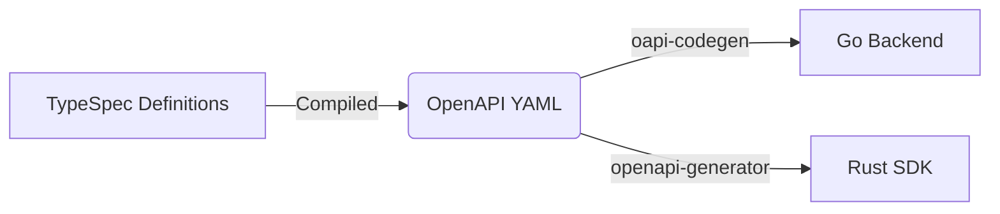
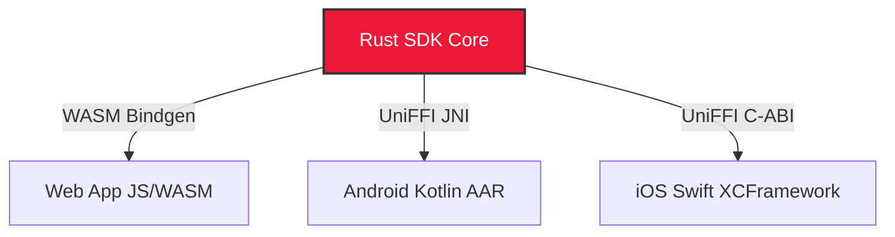

import { Accordion, Accordions } from 'fumadocs-ui/components/accordion';

Welcome to Platrium's development pipeline! We utilize a strict **Design-First** approach driven by a Monorepo that uses the [Nx Build System](https://nx.dev). This means we write our API specifications first, and then heavily automate the generation of our server stubs and client SDKs. 

By automating the boring stuff, we ensure our Go backend and Rust SDK are always 100% perfectly in sync.

Here is a high-level look at how the pipeline works:

## API Definitions in TypeSpec
Everything starts in the `api/` folder. Instead of hand-writing thousands of lines of verbose OpenAPI YAML, we use **[TypeSpec](https://typespec.io)**. 

TypeSpec feels like TypeScript but is designed specifically for defining APIs. You write clean, concise `.tsp` files, and our Nx pipeline automatically compiles them down into a massive, standardized `openapi.yaml` file located in `api/rest/_generated/openapi.yaml`. 

This YAML file becomes the single source of truth for the entire platform.

## The Generators
Once the OpenAPI YAML is generated, the pipeline splits into two distinct paths: the Server and the Client.

### The Core Engine (Go Server)
For the backend, we use `oapi-codegen`. It reads the `openapi.yaml` and spits out strongly-typed Go interfaces and structs directly into the `core/internal/restapi/_generated/` folder.

All the backend developers have to do is implement those interfaces! If the API design changes, the Go compiler will immediately fail if the backend implementation doesn't match the new generated interfaces.

### The SDK (Rust Client)
For the client side, we use the `openapi-generator-cli`. This tool reads the exact same `openapi.yaml` and generates a fully functional Rust REST client inside `sdk/_generated/`. 

This means our SDK developers never have to manually write HTTP requests, serialization logic, or error handling. They just call the generated Rust functions!

## The Cross-Platform SDK
Because Platrium is designed to run everywhere, we built our SDK in **Rust**. But we don't expect mobile or web developers to write Rust!

To solve this, our pipeline automatically compiles the Rust SDK and binds it to other languages using [UniFFI](https://mozilla.github.io/uniffi-rs/).

When you run the build commands (like `nx run sdk:generate-ffi-android`), the pipeline compiles the Rust code into massive `.so` binaries, automatically generates the Kotlin wrapper code, and drops everything into the `sdk/_ffi/android/` folder, ready to be consumed by the Android app!

## Design Decisions

<Accordions>
  <Accordion title="Why Monorepo?">
    Platrium encompasses a Go Backend, a Rust SDK, cross-platform wrappers (Kotlin/Swift/WASM), a Web UI, and a CLI. 
    
    A monorepo allows us to link all these disparate technologies together in an incredibly easy and unified way. When we make an API change, we can instantly test the ripple effect across the Go Server and the Android App in a single pull request, rather than trying to coordinate versions across 5 different Git repositories.
  </Accordion>
  <Accordion title="Why the Nx Build System?">
    With a monorepo this complex, we need a smart way to manage builds. Nx uses a **Directed Acyclic Graph (DAG)** approach, making it super simple to define which modules depend on which others. 
    
    For example, Nx knows that the Rust SDK depends on the API Definitions. It knows the Android App and CLI depend on the Rust SDK. When you run a build, Nx automatically resolves these dependencies and builds them in the exact correct order, heavily caching the results to save time.
  </Accordion>
  <Accordion title="Why not Makefiles?">
    Makefiles are a rite of passage, but for a massive polyglot monorepo spanning Go, Rust, TypeScript, Swift, and Kotlin, they quickly turn into an unmaintainable "PITA" (Pain In The Asterisk). We prefer the structured, JSON-driven, highly extensible ecosystem that Nx provides.
  </Accordion>
  <Accordion title="Why not Buck2 or Bazel?">
    We deeply respect tools like Meta's Buck2 and Google's Bazel for their insane performance and hermetic builds. However, they come with an incredibly steep learning curve. 
    
    We want Platrium to be accessible to new open-source contributors. Nx provides 90% of the benefits of Bazel/Buck2 but with a massively lower barrier to entry and a much more developer-friendly CLI.
  </Accordion>
</Accordions>
