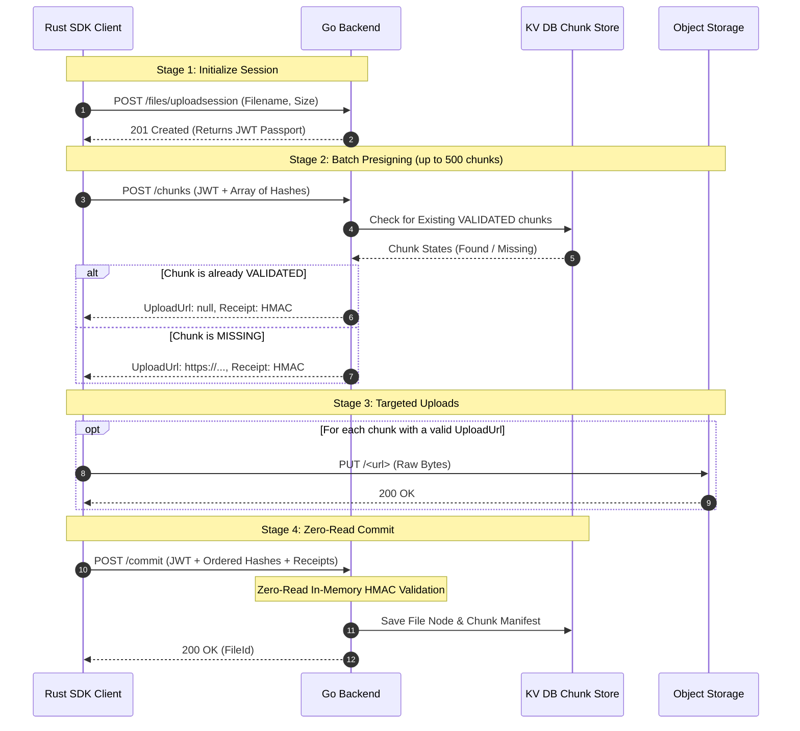

Uploading a file isn't just about moving bytes; it's about security, state management, and deduplication. To achieve massive scale without burning database resources, Platrium uses a unique **Upload Session Flow** backed by JWTs and HMAC receipts.

This document breaks down exactly how the Go Backend processes an upload session from start to finish.

## The Protocol Flow
:::warning
Authentication Middleware and Authorization Flows are not implemented at the time of writing
this document. This section assumes that the user is authenticated and authorized to upload the file.

:::


## Stage 1: The JWT Passport

When a client initiates an upload, they hit `POST /files/uploadsession`. But instead of creating a heavy, stateful database record for the "Pending Upload", the backend goes completely stateless!

The backend generates an **Upload Session Passport**—a cryptographically signed JSON Web Token (JWT).

```go
type UploadSessionPassportClaims struct {
	SessionID      string `json:"session_id"`
	ParentFolderID string `json:"parent_folder_id"`
	Filename       string `json:"filename"`
	FileSize       int64  `json:"file_size"`
	TenantID       string `json:"tenant_id"`
	jwt.RegisteredClaims
}
```

This token contains everything needed to complete the upload. The client must attach this JWT as the `SessionId` in all subsequent requests. By doing this, the backend doesn't need to hit the database to look up what file the client is uploading!

## Stage 2: Validated Chunks & HMAC Receipts

Next, the client sends a batch of up to 500 chunk hashes to `POST /files/uploadsession/chunks`.
The backend reads the JWT provided via header `x-platrium-uploadsession`, then queries the `ChunkStore` for those hashes. 

### Deduplication (The `VALIDATED` State)
If the backend finds a chunk in the store and its state is `fsops.ChunkStateValidated`, it means we already have those exact bytes securely stored. The backend will return `UploadUrl: nil`, telling the client they can instantly skip the upload and save 4MB of bandwidth!

### The Magic of HMAC Receipts
Whether the chunk requires an upload or is deduplicated, the backend generates an **HMAC Receipt** for every single chunk:

```go
func (api *RestAPI) GenerateHMACReceipt(sessionID, hash string, isEOF bool) string {
	h := hmac.New(sha256.New, []byte(api.HMACSecret))
	payload := sessionID + ":" + hash
	if isEOF {
		payload += ":EOF_CHUNK"
	}
	h.Write([]byte(payload))
	return hex.EncodeToString(h.Sum(nil))
}
```

This receipt acts as cryptographic proof that the server explicitly authorized the client to include this specific `hash` in this specific `sessionID`. 

### The `:EOF_CHUNK` Protection
The backend appends an `:EOF_CHUNK` string to the HMAC payload if the client claims its the final chunk in the batch. This is a critical security measure to prevent malicious file truncation. 

During Stage 4 (Zero-Read Commit), the backend iterates through the array of chunks the client wants to commit. It strictly assumes that *only* the absolute last element in that array is the EOF chunk (`isEOF := (i == lastIndex)`). If a malicious client tries to inject an EOF receipt in the middle of the array, or submits an array where the final chunk doesn't have the `:EOF_CHUNK` signature, the backend's recalculated HMAC will completely mismatch the client's receipt. The commit will be instantly rejected, mathematically guaranteeing that the file's structural geometry matches exactly what the server authorized!

## Stage 3: Targeted Uploads & Verification Queue

Once the client receives the presigned URLs, they perform direct `PUT` requests to the Object Storage (e.g., S3). 

:::warning
There is a fundamental trust issue here: **We don't actually know if the client successfully uploaded the bytes to Object Storage!** The client could maliciously skip the upload or fail due to a network drop, yet still try to commit the chunk.
:::

To solve this, our Storage Backends (defined in `core/internal/infra/storage/backend.go`) implement a verification queue system:

```go
// From Backend interface
SubscribeUploadEvents(ctx context.Context, chunkValidationCh chan<- fsops.ValidatedChunk)
```

The `StorageManager` requires all backends to hook into their respective native event streams (e.g., S3 Event Notifications, or local inotify). When a chunk is genuinely written to disk, the backend funnels a `ValidatedChunk` event back into the application layer. This asynchronously marks the chunk as `VALIDATED` in the `ChunkStore`, guaranteeing data integrity completely independent of the client's claims.

## Stage 4: Zero-Read Commit

After the client has uploaded all missing chunks to Object Storage, they hit `POST /files/uploadsession/commit`, provide the JWT Passport in the `x-platrium-uploadsession` header and the ordered list of `(Hash, Receipt)` pairs.

:::info
**Zero-Read In-Memory Validation**
Normally, committing an upload requires hitting the database to verify if the chunks actually belong to the user. Platrium's backend completely skips this database read!
:::

Because the backend holds the `HMACSecret`, it simply iterates over the client's array and recalculates the expected HMAC receipt for each chunk in memory:

```go
// From UploadSessionCommit handler
for i, chunk := range chunks {
    isEOF := (i == lastIndex)
    expectedReceipt := api.GenerateHMACReceipt(claims.SessionID, chunk.Hash, isEOF)

    if chunk.Receipt != expectedReceipt {
        return UploadSessionCommit500JSONResponse{
            Debuginfo: fmt.Sprintf("unauthorized or invalid HMAC receipt..."),
        }, nil
    }
    hexHashes[i] = chunk.Hash
}
```

If every receipt matches perfectly, the backend has mathematically proven the structural geometry of the file. It knows with 100% certainty that it authorized this sequence of chunks. It immediately creates the File Node in the graph database, and the upload is fully completed!

:::note
**What if a user successfully commits, but skipped the Object Storage upload?**
Because the Zero-Read Commit doesn't actively verify if the bytes exist in Object Storage, a malicious user *could* successfully commit a File Node without actually uploading the data. 

However, this only corrupts *their* file! Because the missing chunks will never trigger a native `ValidatedChunk` event from the Storage Backend (as discussed in Stage 3), they will never be marked as `VALIDATED` in the ChunkStore. If a second user attempts to upload the exact same chunk, they will not be offered deduplication (`UploadUrl` will not be `nil`), and they will legitimately upload the missing bytes, healing the system.
:::
