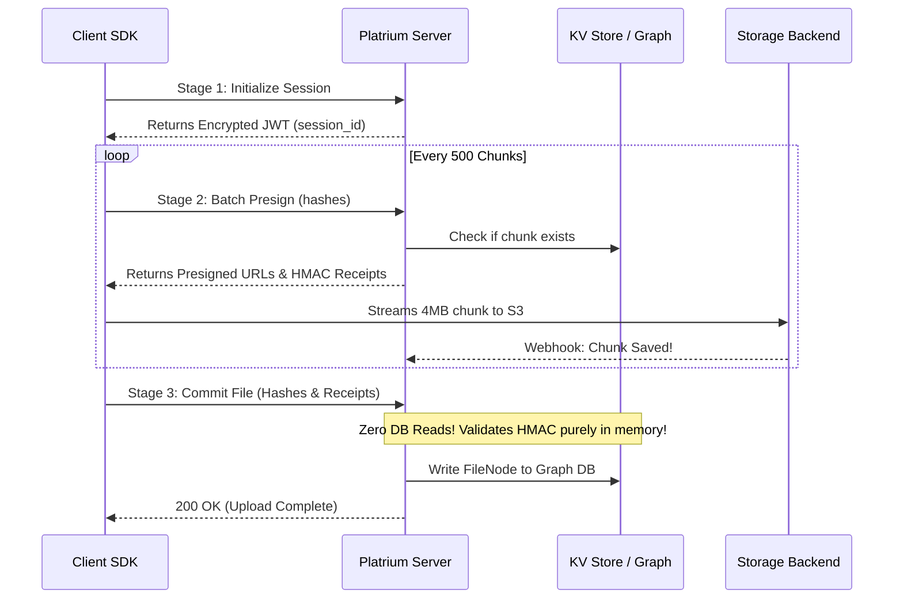

import { Accordion, Accordions } from 'fumadocs-ui/components/accordion';

:::warning
This page is still under review and lacks sufficient detail.
:::

Uploading a multi-terabyte file to a backend without blowing up the server's RAM or database IOPS is a monumental challenge. Most systems use messy database locking, complex reverse-key mapping, and chunky `UploadPartCopy` backend stitching.

Not Platrium! We built a completely stateless, **Loose Chunk CAS (Content-Addressable Storage)** pipeline. It guarantees end-to-end cryptographic integrity, operates with literally zero database reads during the commit phase, and scales horizontally like a dream. 

Let's dive into how it works!

## The Three-Stage Upload Pipeline

When a client wants to upload a file (whether it's a 10KB text file or a 2TB video), they go through three distinct stages.

### Initializing the JWT Passport
The pipeline begins by asking the server for an upload session (`POST /files/uploadsession`). The client provides the target folder ID, the filename, and critically, the exact `file_size` in bytes.

Instead of inserting a row into a bloated relational database to track this session, Platrium seals all this context into an encrypted **JWT Token** and hands it right back to the client! The Go backend cluster remains 100% stateless.

### Batch Chunk Presigning
The client slices the file into fixed 4MB ($4,194,304$ bytes) chunks and hashes them (`SHA-256`) *before* they ever hit the network.

The client sends a batch of up to 500 chunk hashes to the server (`POST /files/uploadsession/{sessionId}/chunks`). The server checks the high-performance KV Store (like TiKV or BadgerDB):
- If the chunk is **PRESENT**, we instantly deduplicate it! No upload needed.
- If it's missing, we issue a presigned URL directly without writing to the database (**Stateless Presigning**). The chunk is only written to the KV store when the storage engine confirms the upload via background event workers.

:::info 
**Cryptographic Receipts:**
For *every single chunk* the client requests, the server returns an HMAC signature (`HMAC-SHA256(ClusterSecret, session_id + chunk_hash)`). This acts as a cryptographic receipt proving the server authorized the client to handle this specific chunk!
:::

#### The End-Of-File Edge Case
What happens to the final chunk if the file isn't perfectly divisible by 4MB? If the client flags `contains_eof_chunk: true`, the server dynamically calculates the trailing byte size using `jwt.file_size % 4MB`. It enforces this exact size in the S3 URL constraints and signs the HMAC receipt using an `EOF_CHUNK` modifier!

### The Zero-Read Commit
Once the client successfully streams all missing chunks to the cloud bucket, they call `POST /files/uploadsession/{sessionId}/commit` and pass the total ordered array of hashes along with their HMAC receipts.

This is where the magic happens. The server **does not query the database** to see if the chunks exist. Instead, it re-calculates the HMAC signatures entirely in-memory using CPU cycles! If the client's receipts match the server's math, we inherently trust that they uploaded the data.

<Accordions>
    <Accordion title="Why bypass the database during commit?">
        In traditional systems, committing a 2TB file (which is 524,288 individual chunks) would require half a million database read queries just to verify they were uploaded. By trusting our own cryptographically generated HMAC receipts, we bypass those 500k reads entirely, saving massive amounts of IOPS!
    </Accordion>
</Accordions>

## Zero-Write Concurrency

What happens if 1,000 users all try to upload the exact same viral meme at the exact same millisecond? Do we hammer the database 1,000 times? Nope!

Platrium's KV store tracks a `last_referenced_at` timestamp for chunks (truncated to the calendar day). If 1,000 users upload the same chunk, only the very first one results in a database write. The other 999 users hit an optimistic concurrency check, see that the chunk was already referenced today, and the server gracefully returns without ever writing to disk.

This completely eliminates hot-chunk database write amplification, a notorious problem in hyperscale storage systems!
