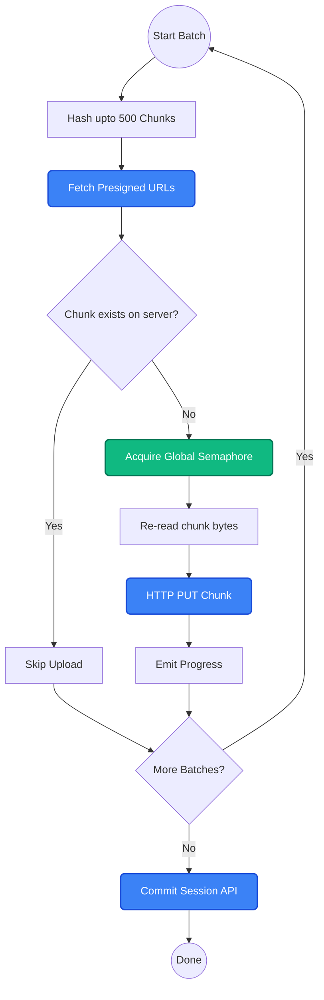

Uploading a massive 50GB file on a mobile phone sounds like a recipe for a frozen UI and an out-of-memory crash. But with Platrium's SDK, it happens flawlessly in the background. 

Instead of blindly streaming bytes to the server, our upload pipeline uses a highly optimized, two-pass, batched backpressure system. It deduplicates data on the fly, minimizes API calls, and integrates seamlessly with our `NetworkTransferManager` to mathematically cap memory usage.

## The Upload Pipeline

After establishing an Upload Session with the server, here is exactly how a batch of file chunks moves 
from your local disk to the cloud:

:::note
For a high-level overview of the upload session APIs and lifecycle, see [Upload Sessions](/e2e-flows/upload-sessions)
:::

## The Two-Pass Batch System

We process the file in batches of **500 chunks**. This batching is critical to avoid spamming the backend with thousands of individual API requests.

### Pass 1: Lightweight Hash Scanning
For the current batch, we read one chunk from the disk at a time, compute its hash, and **immediately discard the bytes from memory!** 

:::info
**Why discard the bytes?** 
If we kept 500 chunks of 4MB in memory while waiting for the network API, we would instantly consume 2GB of RAM. By discarding the bytes after hashing, the hash scan phase never exceeds 4MB of memory!
:::

### Requesting Presigned URLs
We take all 500 hashes and send them to the `upload_session_chunks` API. The server checks its database. If a chunk hash already exists (maybe someone else uploaded it, or a previous upload was interrupted), the server will *not* return an upload URL for it.

### Pass 2: On-Demand Targeted Uploads
Now we look at the response from the server. If a chunk requires uploading, we execute our targeted upload phase:

1. **Backpressure:** We `.await` a global transfer slot from the `NetworkTransferManager`. If the global limit of chunks is already uploading across the app, this task pauses perfectly, consuming zero memory.
2. **Re-reading:** Once a slot opens, we seek back into the file and re-read ONLY that specific chunk's bytes! 
3. **HTTP PUT:** We stream the bytes directly to the Object Storage (S3, Cloudflare R2, etc.) using `reqwest`. We wrap this in a `tokio::select!` block tied to our cancellation token.
4. **Emitting Progress:** We tell the `NetworkTransferManager` how many bytes we just pushed, and it funnels that event back to the UI!

By leveraging this two-pass system, if the server already has 499 of the 500 chunks, we completely skip reading 499 chunks back into RAM and skip 499 HTTP PUTs! 

## Committing the Session

Once every batch is processed, we send a final `upload_session_commit` API request with the receipts from the Object Storage. The server finalizes the file, the `NetworkTransferManager` emits the `Completed` event to the UI, and the job is done!
